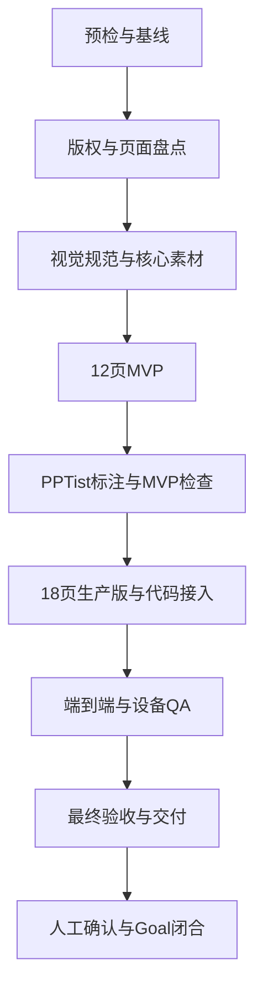

# AI 霓虹科技 PPT 模板开发 Goal

## 1. Goal 信息

| 项目 | 内容 |
|---|---|
| Goal 名称 | 完成 AI 霓虹科技 PPT 模板开发 |
| 工作目录 | `D:\moling\TrainPPTAgent` |
| 模板 ID | `template_9`，执行前必须确认未被占用 |
| 模板名称 | AI 霓虹科技 |
| 参考 PPT | `C:\Users\sk20\Desktop\产品发布 (4).pptx` |
| 主开发文档 | [`AI霓虹科技PPT模板开发说明.md`](./AI霓虹科技PPT模板开发说明.md) |
| 当前状态 | `DONE`，G0～G7 自动验收通过，G8 已由用户于 2026-08-25 确认闭合 |
| 目标状态 | G7 自动验收通过后进入 `READY_FOR_CONFIRMATION`，G8 用户确认后闭合为 `DONE` |
| Git 策略 | 默认不提交、不推送、不创建 PR、不合并、不部署 |
| Goal 预算 | 不预设 token budget |

创建本文档不等于启动 Goal，也不代表模板已经开发。

本文末尾保留可复用的 Goal 执行提示词。本轮已按该目标完成 G0～G7 自动执行，并在 G8 收到用户于 2026-08-25 给出的人工闭合确认。

> **图片生成说明：** 模板需要的背景、透明装饰和 AI 核心插画允许使用 GPT Image 2（`gpt-image-2`，本文简称 GPT2 图片模型）生成。本轮已通过 Codex 内置图片生成工具完成 8 项素材；实际模型标识未由工具暴露，记录中没有虚构模型名称。

## 2. Goal Objective

在 TrainPPTAgent 中完成 `template_9` AI 霓虹科技模板的本地开发和完整验证。

模板以参考 PPT 的深蓝、青紫霓虹和 AI 科技氛围为视觉方向，但所有生产页面必须重构为 16:9，并符合项目现有 PPTist 模板协议。

Goal 完成后，用户应获得以下能力：

1. 模板选择页显示“AI 霓虹科技”和正确封面。
2. 用户可以选择模板并生成完整 PPT。
3. 模板覆盖封面、目录、章节、内容和结束页。
4. 目录支持 2、3、4、5、6、10 项。
5. 内容页支持 1、2、3、4 项，超量和超长内容无损分页。
6. 模板支持纯文字、单图文和双图文页面。
7. Agent 配图只替换内容图片，不覆盖背景和装饰。
8. 用户可以编辑文字并替换内容图片。
9. 用户可以导出 PPTX，并重新导入项目继续编辑。
10. 桌面、笔记本、平板和手机端都能正常预览和操作。

## 3. Goal 范围

### 3.1 必须完成

- 检查工作区、参考文件、模板 ID 和现有实现。
- 完成参考 PPT 的页面、字体、媒体、音频和版权盘点。
- 固化 16:9 视觉规范和页面安全区。
- 生产开发说明中列出的 8 项 V1 核心素材。
- 完成 12 页 MVP。
- 完成 PPTist 页面、文字、图片和分组标注。
- 生成并整理 `template_9.json` 和 `template_9.jpg`。
- 扩展到 18 页生产版。
- 注册模板并增加模板专项测试。
- 验证内容容量、分页、图片隔离和资源完整性。
- 完成真实生成、编辑、图片替换、失败重试和多设备 QA。
- 完成 PPTX 导出和重新导入验证。
- 保存素材来源、生成提示词、测试结果和截图证据。
- 输出最终验收报告，进入待确认状态并等待用户确认闭合。

### 3.2 不在本 Goal 范围

- 不直接把参考 PPTX 当作生产模板。
- 不把约 3:1 的原页面整体压缩或拉伸成 16:9。
- 不重写 PPTist 编辑器或模板渲染器架构。
- 不在 V1 增加专用指标页和流程页。
- 不修改 Agent 数据协议，除非基础模板无法使用现有协议实现。
- 不使用来源不明的字体、照片、插画、Logo、音频和水印。
- 不生成伪造产品截图、业务数据、证书或真实人物。
- 不删除、覆盖或格式化与本 Goal 无关的用户文件。
- 不主动提交、推送、创建 PR、合并或部署。

## 4. 完成定义

Goal 不设置逐阶段人工审批。G0～G7 根据证据连续执行，阶段检查失败时应定位原因、修复并重新验证。

G0～G6 检查通过后自动确认并继续。G7 自动验收全部通过后进入 `READY_FOR_CONFIRMATION`，提交最终报告并等待用户确认。G8 是唯一人工门禁；只有用户明确确认后，才能标记 `DONE` 并闭合 Goal。

### 4.1 模板产物

- `backend/main_api/template/template_9.json` 已生成。
- `backend/main_api/template/template_9.jpg` 已生成。
- 实际引用的 `template_9_asset_*` 素材已保存。
- `backend/main_api/tests/test_template_9.py` 已生成。
- `doc/AI霓虹科技PPT模板素材与QA记录.md` 已完成。
- 模板列表和资源接口可以返回模板 JSON、封面和素材。

### 4.2 页面覆盖

生产模板必须为 18 页：

| 类型 | 数量 |
|---|---:|
| 封面 `cover` | 2 |
| 目录 `contents` | 6 |
| 章节 `transition` | 2 |
| 内容 `content` | 6 |
| 结束 `end` | 2 |
| 合计 | 18 |

`metadata.mvpSlideIds` 必须精确标记 12 页 MVP：

- 1 页封面。
- 6 页目录。
- 1 页章节。
- 3 页内容，分别支持 2、3、4 项。
- 1 页结束。

生产内容页必须覆盖：单结论、两项、三项、四项、单图文和双图文。

### 4.3 生成与编辑

- 封面标题和副标题进入正确槽位。
- 目录按 2、3、4、5、6、10 项选择对应版式。
- 1～4 项内容选择容量合适的版式。
- 8 项内容分页后顺序和字符保持完整。
- 长正文不截断，不依赖低于 12px 的字号。
- 内容图片可以被 Agent 填充并由用户替换。
- 背景和装饰不会被 Agent 图片覆盖。
- 无图片输入时不出现破图或异常空框。

### 4.4 视觉与设备

- 18 页逐页视觉检查通过。
- 不存在文字越界、异常换行、破图、拉伸和装饰遮挡。
- 导出前后字体、换行、图片裁切和装饰位置保持稳定。
- 1920×1080、1366×768、768×1024、390×844 四种视口无横向溢出。
- 模板选择、生成、失败重试、图片替换和导出按钮都有可见反馈。

### 4.5 测试与证据

- 模板专项测试通过。
- 模板渲染器相关回归测试通过。
- 受影响的后端测试通过。
- 前端类型检查、单元测试和生产构建通过。
- 真实生成结果、逐页截图和总览图已保存。
- PPTX 导出物已保存并重新导入验证。
- 素材来源、生成提示词和人工检查结果已记录。
- 所有失败、偏差和已知限制已如实记录。

只创建模板文件，或只通过单元测试，不算 Goal 完成。

## 5. 硬性约束

### 5.1 参考模板和版权

- 参考 PPT 只作为视觉和布局方向参考。
- 原稿约为 3:1，所有生产页面必须重构为 16:9。
- 未确认授权的图片、字体、Logo、音频和来源标识不得发布。
- 所有新位图必须原创或具有明确授权。
- 不生成文字、数字、Logo、水印、固定年份和真实产品界面。
- 不生成可被误认为真实证据的截图、证书或业务数据。

### 5.2 图片生产

- 背景、透明装饰和 AI 核心插画允许使用 GPT2 图片模型生成，并通过适用的图片生成技能或工具调用。
- 不使用 Python 或程序化绘图生成位图装饰。
- 每种素材单独生成，不生成难以裁切的素材拼图。
- 保存最终提示词、实际模型名称、原始输出、发布路径和人工检查结果。
- 背景使用 JPG，透明装饰使用具有真实 Alpha 通道的 PNG。
- 简单线条、圆环、卡片和基础几何使用 PPTist 可编辑形状。

V1 核心位图为：

| 文件 | 规格 |
|---|---|
| `template_9_asset_bg_cover_v1.jpg` | 1920×1080，小于 350KB |
| `template_9_asset_bg_section_v1.jpg` | 1920×1080，小于 300KB |
| `template_9_asset_bg_end_v1.jpg` | 1920×1080，小于 300KB |
| `template_9_asset_orb_cluster_v1.png` | 1600×800，透明，小于 1MB |
| `template_9_asset_neon_ribbon_v1.png` | 1800×600，透明，小于 1MB |
| `template_9_asset_particles_v1.png` | 1920×1080，透明，小于 1MB |
| `template_9_asset_corner_circuit_v1.png` | 1200×1200，透明，小于 1MB |
| `template_9_asset_ai_core_v1.png` | 1600×1200，透明，小于 1.5MB |

未被模板实际引用的素材不得进入发布目录。

### 5.3 模板和代码

- 模板画布固定为 1000 × 562.5。
- 页面类型只使用 `cover`、`contents`、`transition`、`content`、`end`。
- 图片使用 `/api/data/` 地址，JSON 不内嵌 Base64 大图。
- 页面 ID 和元素 ID 必须唯一。
- 内容图片使用 `imageType: "content"`。
- 背景和装饰使用 `imageType: "decoration"`。
- 同一内容项的语义元素使用一致的 `groupId`。
- 先验证现有渲染器，只有测试证明不足时才做最小兼容修改。
- 不得为了 `template_9` 破坏 `template_1`～`template_8`。
- 新增代码使用中文注解解释关键逻辑。

### 5.4 前端和响应式

- 前端变更必须兼顾桌面、笔记本、平板和手机。
- 预览画布始终保持 16:9。
- 模板卡片必须显示选中状态。
- 加载、成功、失败和重试必须有可见反馈。
- 返回、图片替换、下载和导出按钮不能点击无反应。

### 5.5 工作区和 Git

- 开始前检查 Git 状态并记录用户已有改动。
- 不覆盖、清理或格式化与本 Goal 无关的文件。
- 不删除现有 `.codex-tmp`、`.codex_tmp` 或其他用户工作文件。
- 不使用 `git reset --hard`、`git clean` 等破坏性命令。
- 默认不提交、推送、创建 PR、合并或部署。

## 6. 计划产物

| 产物 | 说明 |
|---|---|
| `template_9.json` | 18 页生产模板，含 12 页 MVP 标记 |
| `template_9.jpg` | 模板列表封面 |
| `template_9_asset_*` | 实际使用的背景和透明装饰 |
| `test_template_9.py` | 结构、容量、分页、图片和资源专项测试 |
| 素材与 QA 记录 | 来源、提示词、尺寸、测试、截图和限制 |
| PPTX QA 导出物 | 真实生成结果的导出文件 |
| 最终验收报告 | 完成项、验证结果、限制和确认状态 |

主要文件范围：

- `backend/main_api/template/`
- `backend/main_api/main.py`
- `backend/main_api/tests/test_template_9.py`
- 必要时修改 `backend/main_api/workers/template_renderer.py`
- 必要时检查前端模板入口和交互文件
- `doc/AI霓虹科技PPT模板开发说明.md`
- `doc/AI霓虹科技PPT模板开发Goal.md`
- `doc/AI霓虹科技PPT模板素材与QA记录.md`

## 7. Goal 任务图



G0～G7 连续执行。阶段检查失败时自动修复并重试；G0～G6 检查通过后自动确认，不设置阶段性人工质量门禁。

G7 自动验收通过后进入 `READY_FOR_CONFIRMATION`，等待用户在 G8 人工确认闭合。

## 8. 分阶段执行计划

### G0：预检与基线

任务：

- 完整阅读本 Goal、主开发文档和其中引用的协议、渲染器与测试。
- 检查 Git 状态并记录用户已有改动。
- 确认参考 PPT 可读，确认实际页数和页面比例。
- 检查 `template_9` 是否已被占用。
- 确认模板资源目录、测试入口、浏览器 QA 和 PPTX 导出路径。
- 建立素材与 QA 记录文件。

阶段出口：

- 工作区已有改动受到保护。
- 模板 ID、文件范围、参考文件和验证入口明确。
- 基线测试或现有状态已记录。

### G1：版权与页面盘点

任务：

- 逐页审计参考 PPT 的 25 页。
- 建立保留、重建、提取装饰和删除清单。
- 识别所有字体、图片、图表、音频和来源文字。
- 确定 12 页 MVP 和 18 页生产版映射。
- 为每个生产页面记录类型、容量、文字安全区和图片槽。

阶段出口：

- 25 页都有明确处理结论。
- 未授权内容都有删除或替换方案。
- MVP 和生产版页面清单完整。

### G2：视觉规范与核心素材

任务：

- 固定颜色、字体、字号、边距、发光和安全区。
- 先完成一张封面和一张四项内容页样稿。
- 使用 GPT2 图片模型和适用的图片生成技能或工具，生产 8 项 V1 核心位图。
- 检查透明通道、伪文字、白边、构图和文件大小。
- 保存最终提示词、实际模型名称、源文件和发布文件记录。

阶段出口：

- 两张 16:9 样稿无文字和装饰冲突。
- 8 项素材满足格式、尺寸、体积和版权要求。
- 发布目录只包含实际需要的素材。

### G3：12 页 MVP

制作：

- 1 页封面。
- 6 页目录，支持 2、3、4、5、6、10 项。
- 1 页章节。
- 3 页内容，支持 2、3、4 项。
- 1 页结束。

阶段出口：

- 12 页均可编辑。
- 字体、字号、边距和视觉语言统一。
- 没有残留示例文案、来源标识和未授权素材。
- 每页都有明确、足量的语义槽位。

### G4：PPTist 标注与 MVP 自动检查

任务：

- 标注五种页面类型。
- 标注 `title`、`content`、`item`、`itemTitle`、`itemNumber`、`partNumber`。
- 标注 `content` 和 `decoration` 图片。
- 为同一内容组设置一致的 `groupId`。
- 导出并整理 `template_9.json`。
- 设置 `metadata.mvpSlideIds`。
- 生成临时封面并完成 MVP 功能验证。

MVP 自动检查：

- 目录容量选择正确。
- 2、3、4 项内容选择正确。
- 8 项内容无损分页。
- 长正文不截断，最小字号不低于 12px。
- 内容图片与装饰图片隔离。
- MVP 可以完成一次真实生成和 PPTX 往返。

MVP 检查未通过时自动定位、修复并重试。检查通过后自动确认并进入 G5，不请求人工放行。

### G5：18 页生产版与代码接入

任务：

- 增加第二封面和第二章节页。
- 增加单结论、单图文和双图文内容页。
- 增加第二结束页。
- 生成正式 `template_9.jpg`。
- 在模板列表注册 `template_9`。
- 新增 `test_template_9.py`。
- 验证资源、ID、容量、分页、图片隔离和文件体积。
- 运行现有模板相关回归测试。
- 只有测试证明必要时，才修改渲染器或前端入口。

阶段出口：

- 生产版为 18 页，类型数量正确。
- 新页面用途明确，不是简单颜色变体。
- 模板列表和资源接口可返回新模板。
- 新旧模板相关自动测试通过。

### G6：端到端与设备 QA

任务：

- 按项目运行方式启动必要的最小服务集合。
- 在模板选择页验证名称、封面和选中反馈。
- 使用真实语义数据生成覆盖五种页面类型的作品。
- 验证文字编辑、内容图片替换和失败重试。
- 检查四种代表视口。
- 导出 PPTX 并重新导入项目。
- 保存逐页截图、总览图、导出物和控制台结果。

阶段出口：

- 生成、编辑、替换、重试和导出主流程通过。
- 四种视口无横向溢出和按钮遮挡。
- 18 页没有模板相关视觉缺陷。
- PPTX 重新导入后页面、文字、图片和装饰保持稳定。

### G7：最终验收与交付

任务：

- 运行所有受影响的后端和前端测试。
- 复验真实生成、编辑、换图、导出和重新导入。
- 检查 JSON、封面、素材体积、失效路径和未引用文件。
- 检查版权、提示词、截图和 QA 记录。
- 汇总所有新增与修改文件。
- 完成最终验收报告。

阶段出口：

- 第 4 章完成定义和第 9 章自动验收全部满足。
- 测试失败、版权风险和已知限制均已说明。
- 状态更新为 `READY_FOR_CONFIRMATION`。
- 提交最终报告并请求用户确认。

自动验收结果和证据应写入最终报告。只有用户明确回复“确认完成”或同等含义的指令后，才将 Goal 更新为 `DONE` 并闭合。

### G8：人工确认与 Goal 闭合

任务：

- 接收并记录用户对 G7 最终报告的明确确认。
- 将 Goal 状态从 `READY_FOR_CONFIRMATION` 更新为 `DONE`。
- 记录闭合日期；不把提交、推送、合并或部署视为默认闭合动作。

阶段出口：

- 用户已明确回复“确认完成”或同等含义的指令。
- Goal 状态为 `DONE`，人工确认时间和最终证据可追溯。

G8 不执行新的开发或自动替用户确认。本项目已于 2026-08-25 收到用户“确认完成”，因此该阶段已闭合。

## 9. 自动验收清单

### 9.1 模板结构

- [x] `template_9.json` 可以解析。
- [x] 画布为 1000 × 562.5。
- [x] 生产版为 18 页，MVP 标记为 12 页。
- [x] 五种页面类型全部存在。
- [x] 页面和元素 ID 全部唯一。
- [x] JSON 不包含 Base64 大图和本机路径。
- [x] 外置资源都存在，并至少被一页引用。

### 9.2 内容生成

- [x] 目录精确支持 2、3、4、5、6、10 项。
- [x] 内容支持 1、2、3、4 项。
- [x] 8 项内容分页后顺序和字符不变。
- [x] 长正文不截断，字号不低于 12px。
- [x] 缺少必要槽位时显式失败。
- [x] 未使用内容组被完整删除。

### 9.3 图片保护

- [x] 0、1、2 张内容图片都能正确处理。
- [x] Agent 图片只进入内容图片槽。
- [x] 装饰图片保持原地址。
- [x] 无图片时不出现破图和异常空框。
- [x] 用户可以选中并替换内容图片。
- [x] 横图、竖图和方图裁切正常。

### 9.4 视觉和设备

- [x] 18 页无文字越界、破图、拉伸和装饰遮挡。
- [x] 标题、正文、边距和颜色保持一致。
- [x] 霓虹效果不影响文字可读性。
- [x] 四种视口无横向溢出和按钮遮挡。
- [x] 手机端可以滚动、预览和导出。
- [x] 所有可见按钮都有交互反馈。

### 9.5 导出与回归

- [x] PPTX 可以导出并正常打开。
- [x] 导出前后页面数量一致。
- [x] 重新导入后标题、正文和图片仍存在。
- [x] 字体、换行、裁切和装饰位置稳定。
- [x] 模板专项和渲染器回归测试通过。
- [x] 受影响的后端测试通过。
- [x] 前端类型检查、单元测试和生产构建通过。

### 9.6 版权和证据

- [x] 每个素材都有来源或生成记录。
- [x] 生成素材保存最终提示词和模型信息。
- [x] 不存在来源不明的照片、字体、Logo 和水印。
- [x] QA 截图、总览图、PPTX 和测试结果已保存。
- [x] 已知限制和未决事项已记录。

## 10. 自动决策与人工边界

### 10.1 可以自动决定

- 没有 Logo 时保留无 Logo 设计，不生成假 Logo。
- 没有真实人物时使用无人物版式。
- 原素材授权不明确时生成原创替代素材。
- 没有指定年份时不写死年份。
- 简单几何装饰使用 PPTist 形状。
- 图片效果不合格时重新生成或重新裁切。
- 测试、视觉或导出失败时定位根因、修复并重新验证。
- 现有渲染器满足需求时不修改渲染器。
- 阶段检查通过后继续下一阶段，不等待逐阶段批准。

### 10.2 仍需用户授权的外部操作

- `template_9` 已被其他正式模板占用。
- 需要使用真实公司 Logo、人物、内部数据或付费素材。
- 需要接受授权范围不明确的商业素材。
- 需要删除或覆盖与 Goal 无关的用户文件。
- 需要提交、推送、创建 PR、合并或部署。
- G8 的最终人工确认与 Goal 闭合操作。

这些是权限边界，不是阶段性质量门禁。未获得授权时，只暂停对应外部、不可逆或最终闭合操作；其他安全、可逆、范围内的工作继续自动执行。

### 10.3 阻断规则

普通测试失败、图片效果不佳、版式溢出、服务启动问题和局部代码问题不构成阻断。

执行者应先定位原因，尝试安全修复和替代路径，并继续其他未受影响的范围内工作。

只有同一外部阻断重复出现，安全替代方案已经尝试，且没有其他范围内工作可以继续时，才报告 `BLOCKED`。

## 11. 进度与最终报告格式

### 11.1 阶段进度

```text
[阶段] G3：12 页 MVP
[状态] 完成 / 进行中 / 阻断
[已完成] 本轮完成的页面、文件和功能
[验证] 已运行的测试、截图或检查结果
[发现] 风险、差异和失败尝试
[下一步] 下一个具体任务
```

进度更新必须包含可检查的文件、测试或页面结果，不能只说“正在处理”。

长时间执行期间，用户不应超过 60 秒收不到有内容的进度更新。

### 11.2 最终交付报告

```text
STATUS: READY_FOR_CONFIRMATION / DONE / DONE_WITH_CONCERNS / BLOCKED

完成内容：
- 模板页面数量和类型
- 生成的素材
- 修改的代码和配置
- 新增的测试

验证结果：
- 后端和前端测试
- 真实生成、编辑和图片替换
- PPTX 导出和重新导入
- 多设备检查

产物：
- 模板 JSON 和封面
- 图片资源和提示词记录
- QA 截图、总览图和导出物

剩余问题：
- 已知限制
- 未决授权或真实数据需求
- 后续可选优化

人工确认：
- 自动验收通过后填写“等待用户确认”
- 用户明确确认后填写“已确认闭合”
```

## 12. Goal 执行提示词

以下提示词用于未来启动本 Goal。当前创建本文档时不要执行提示词中的任何操作。

```text
请在 D:\moling\TrainPPTAgent 创建并持续执行一个持久 Goal：完成 AI 霓虹科技 PPT 模板开发。不要设置 token budget。

Goal 目标：
基于 doc\AI霓虹科技PPT模板开发说明.md 和 doc\AI霓虹科技PPT模板开发Goal.md，完成 template_9 AI 霓虹科技模板的参考页与版权盘点、16:9重构、原创素材生产、12页MVP、PPTist标注、JSON资源外置、18页生产版、后端注册、自动化测试、端到端QA、响应式检查和PPTX往返验证。

开始前必须：
1. 完整阅读两份主文档，以及其中列出的 Template.md、PPT_Structure.md、API_TEMPLATE.md、模板渲染器和测试文件。
2. 检查 Git 状态，记录并保护用户已有改动，不清理 .codex-tmp、.codex_tmp 或其他无关文件。
3. 确认 template_9 没有被其他正式模板占用。
4. 确认参考 PPT 路径为 C:\Users\sk20\Desktop\产品发布 (4).pptx。
5. 建立 doc\AI霓虹科技PPT模板素材与QA记录.md，持续记录素材、提示词、测试和证据。
6. 根据当前仓库状态确认真实可用的测试、服务启动、浏览器QA和PPTX导出命令，不照抄过期结果。

执行顺序：
G0 预检与基线 → G1 版权与页面盘点 → G2 视觉规范与核心素材 → G3 12页MVP → G4 PPTist标注与MVP自动检查 → G5 18页生产版与代码接入 → G6 端到端与设备QA → G7 最终验收与交付 → G8 人工确认与Goal闭合。

硬性要求：
- 原参考PPT只作视觉和布局参考，不能直接复用授权不明的照片、字体、Logo、音频和来源标识。
- 原稿约为3:1，所有生产页面必须重构为16:9，逻辑画布固定为1000×562.5。
- 模板需要的背景、透明装饰和AI核心插画可以使用GPT Image 2（gpt-image-2，简称GPT2图片模型）生成，并通过适用的图片生成技能或工具调用。
- 不使用Python或程序化绘图生成位图装饰。
- V1只生产开发说明列出的8项核心素材；每种素材使用独立提示词。
- 保存最终提示词、实际模型名称、原始输出、发布路径、尺寸、体积、Alpha检查和人工审核结果。
- 未被template_9实际引用的素材不得进入发布目录。
- 背景和装饰不能包含文字、数字、Logo、水印、固定年份、真实人物、真实产品界面、假截图或假数据。
- 简单线条、圆环、卡片、编号和基础几何使用PPTist可编辑形状。
- 首版只使用cover、contents、transition、content、end五种页面。
- MVP为12页，生产版为18页，数量和类型严格遵循Goal文档。
- 目录必须覆盖2、3、4、5、6、10项；内容必须覆盖1、2、3、4项。
- 长正文和超量内容不得静默丢失或依赖低于12px的字号。
- 只有imageType: content的图片可以被Agent或用户替换。
- imageType: decoration的背景和装饰必须保持不变。
- 同一内容项的语义元素使用一致groupId，未使用分组必须完整移除。
- 图片使用/api/data/地址，模板JSON不内嵌Base64大图，不包含本机路径。
- 页面ID和元素ID必须唯一，模板资源必须存在并被实际引用。
- 默认不修改template_renderer.py和前端入口。只有测试证明必要时才做最小兼容修改，并补充回归测试。
- 不得为了template_9破坏template_1至template_8。
- 新增代码使用中文注解解释关键逻辑。
- 前端变化必须适配1920×1080、1366×768、768×1024、390×844。
- 模板选择、生成、失败重试、替换图片、返回、下载和导出按钮必须有可见反馈。
- 不覆盖用户无关改动，不使用git reset --hard、git clean等破坏性命令。
- 不主动提交、推送、创建PR、合并或部署。
- 不以截图、HTTP 200、单个测试或主观判断单独证明完成。

工作方式：
- 每个阶段执行“检查输入和依赖 → 实施 → 验证 → 记录证据”。
- G0至G6连续推进，每个检查点通过后自动确认，不等待用户逐阶段批准；G7自动验收后进入待确认状态；G8仅记录用户人工确认并闭合。
- 先完成12页MVP。MVP真实生成、图片保护、长文本和PPTX往返通过后，才扩展18页生产版。
- 遇到测试、视觉、导出或服务问题时先定位根因，再修复并重新验证，不降低断言、不跳过测试、不隐藏错误。
- 先复用现有能力，只有证据证明不足时才做范围内最小修改。
- 长时间执行时每60秒内提供一次有内容的进度更新，说明完成项、验证、发现和下一步。
- 只有涉及模板ID冲突、真实Logo或人物、内部数据、付费或授权不明素材、无关文件破坏、提交推送合并部署时才请求用户授权。
- G7验收完成后提交最终报告并请求用户确认；未确认前不得进入G8、标记DONE或闭合Goal。

自动检查点：
- G2自动检查核心素材的版权、透明度和体积；通过后继续。
- G4自动检查12页MVP真实生成、目录与内容容量、无损分页、图片隔离和PPTX往返；失败时修复重试，通过后继续。
- G5自动检查18页生产版、模板注册、专项测试和旧模板回归；通过后继续。
- G6自动检查真实生成、编辑、图片替换、失败重试、四种视口和PPTX重新导入；通过后继续。
- G7自动检查Goal文档第4章和第9章全部条件；通过后进入READY_FOR_CONFIRMATION并请求用户确认。
- G8仅在收到用户明确确认后执行状态闭合，不自动确认、不新增开发任务。

完成标准：
模板JSON、正式封面、实际引用素材、18页结构、12页MVP标记、素材记录、自动化测试、真实生成、文字编辑、图片替换、四种设备检查、PPTX导出与重新导入全部有可复查证据后，将Goal标记为READY_FOR_CONFIRMATION，提交最终报告并等待用户确认。

不得因为开发文档、素材、MVP、HTTP 200或部分测试完成就声称整个Goal完成。自动验收通过也不得直接报告DONE；只有用户明确回复“确认完成”或同等含义的指令后，才可以闭合。

最终输出：
列出所有新增和修改文件、页面与素材数量、图片提示词记录、测试命令和结果、真实生成证据、QA截图、PPTX导出物、资源体积、已知限制和未决事项。自动验收通过后请求用户人工确认；未确认前不得闭合Goal。
```

## 13. 相关文档

- [`AI霓虹科技PPT模板开发说明.md`](./AI霓虹科技PPT模板开发说明.md)
- [`Template.md`](./Template.md)
- [`PPT_Structure.md`](./PPT_Structure.md)
- [`API_TEMPLATE.md`](./API_TEMPLATE.md)
- [`科技蓝扁平PPT模板开发Goal.md`](./科技蓝扁平PPT模板开发Goal.md)
- [`红金年会颁奖PPT模板开发Goal.md`](./红金年会颁奖PPT模板开发Goal.md)

## 14. 当前状态

状态：`DONE`。

已完成：

- G0～G7 阶段任务和自动验收，以及 G8 人工确认闭合。
- 18 页生产模板、12 页 MVP 标记和 8 项核心素材。
- 模板注册、专项测试、后端全量、前端类型检查、单测和构建。
- 真实持久任务、文字编辑、图片替换、失败重试和四种视口检查。
- 两份真实浏览器 PPTX 导出和项目同款重新导入。
- 素材与 QA 记录、截图、总览图和最终审计。

人工确认：

- 用户已于 2026-08-25 明确回复“确认完成”。
- 人工闭合门禁通过，持久 Goal 已标记为 `DONE`。
- 未提交、推送、创建 PR、合并或部署。
