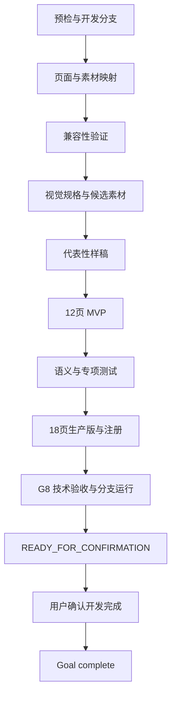

# 桃夭墨韵商务汇报 PPT 模板开发 Goal

## 1. Goal 状态

| 项目 | 内容 |
|---|---|
| Goal 名称 | 完成桃夭墨韵商务汇报 PPT 模板开发、分支运行与人工确认 |
| Goal 类型 | 单一开发 Goal，阶段固定为 G0～G8 |
| 候选模板 ID | `template_22`，G0 重新扫描确认 |
| 开发说明 | [桃夭墨韵商务汇报PPT模板开发说明.md](./桃夭墨韵商务汇报PPT模板开发说明.md) |
| 执行提示词 | [桃夭墨韵商务汇报PPT模板开发Goal执行提示词.md](./桃夭墨韵商务汇报PPT模板开发Goal执行提示词.md) |
| 参考 PPT | `%USERPROFILE%\Desktop\中国风格(5).pptx` |
| 参考 SHA-256 | `17CBC63F0D9D77B9D8B78018047FEB10D0D284C150A5E761208CF4E0B683460E` |
| Goal 文档状态 | `COMPLETE` |
| Goal 工具状态 | `COMPLETE` |
| 原 Goal 状态 | `DONE`，已确认候选 `template_22-g8-db790bc36b0a` |
| 当前热修复状态 | `HOTFIX_READY_FOR_CONFIRMATION` |
| 当前交付候选 | `template_22-hotfix-be9af16783e9` |
| 技术验收目标 | G8 完成后进入 `READY_FOR_CONFIRMATION` |
| Goal 完成条件 | G8 自动检测无问题后进入 `READY_FOR_CONFIRMATION`，用户明确确认当前候选版本开发完成 |
| 编写日期 | 2026-09-15 |

本文定义后续实际开发 Goal。创建或修改本文档不代表 Goal 已创建，也不授权当前执行开发、运行服务或 Git 交付。

用户后续发送完整执行提示词并明确要求开始时，授权 G0～G8 的本地开发、规划内图片生成、测试、运行开发分支及人工确认准备。

## 2. Goal Objective

在 `D:\moling\TrainPPTAgent` 的独立开发分支中，将参考 PPT 的桃花、宣纸、卷轴和水墨题框语言重构为项目原生模板。

模板需满足：

- 可以从模板列表选择并生成。
- 标题和正文可以编辑。
- 内容图片可以替换，固定装饰不会被覆盖。
- 原始标题、正文和项目顺序完整保留。
- JSON 保存重载和 PPTX 导出重导入稳定。
- 桌面、笔记本、平板和手机能够完成相关操作。
- G8 结束时运行当前开发分支程序，提供可访问候选版本供用户检查。

开发阶段只有 G0～G8。G8 自动检查通过后只能进入 `READY_FOR_CONFIRMATION` 并停止自动闭合；用户明确确认开发完成后，当前 Goal 才能标记 `complete` 并闭合。

### 2.1 自动推进

- G0～G7 自动执行、自动确认并连续推进。
- 普通测试失败、文字溢出、裁切异常和资源错误在授权范围内自动修复和重验。
- 候选 ID 冲突时自动选择下一个安全编号并同步文件。
- 来源不明的源素材自动排除，改用原创或授权明确的替代素材。
- 主观相似度、差异度和视觉查重只记录 `NOTE`，不阻塞阶段通过。
- G8 自动完成技术验收和开发分支运行准备，候选可访问后才请求用户确认。
- 用户要求修改时继续当前 Goal，修复并按影响范围重验，再提供更新候选。

## 3. 权威输入与范围

### 3.1 执行时读取

1. `AGENTS.md`
2. `doc\桃夭墨韵商务汇报PPT模板开发说明.md`
3. `doc\桃夭墨韵商务汇报PPT模板开发Goal.md`
4. `doc\桃夭墨韵商务汇报PPT模板开发Goal执行提示词.md`
5. `doc\Template.md`
6. `doc\PPT_Structure.md`
7. `backend\main_api\workers\template_renderer.py`
8. `backend\main_api\template_assets.py`
9. 与当前修改直接相关的公共测试

旧模板文档和历史 QA 不属于启动必读项。需要具体接口示例时再定向读取，不继承其阶段、页面库存、素材数量和验收流程。

### 3.2 Goal 内

- 独立开发分支与工作区预检。
- 参考稿 26 页的页面和素材处理映射。
- 当前模板需要的兼容性验证。
- 桃花水墨视觉规格与候选装饰素材。
- 12 页 MVP 和 18 页核心生产版。
- 确定性构建器、语义标注、专项测试和必要回归。
- 模板封面、注册项和资源接口。
- G8 技术验收、开发分支程序运行和人工确认准备。
- 用户反馈后的范围内修复与重验。

### 3.3 Goal 外

- 三图画廊、流程、时间轴、Venn 图和路线图等未纳入首版的扩展页面。
- 通用 PPTX 导入器改造、历史模板迁移和全量字体兼容。
- 与本模板无关的功能和架构开发。
- 用户确认开发完成后的提交、推送、PR、合并和部署。

## 4. 完成定义

以下条目由执行者根据当前阶段的有效证据自动更新。后续阶段尚未实现的能力保持待办，不作为当前阶段失败。

### 4.1 基线与映射

- [x] 使用独立开发分支，不在 `main` 直接实施模板。
- [x] 最终模板 ID 无冲突。
- [x] 参考 PPT 存在且 SHA-256 一致。
- [x] 用户已有修改和未跟踪产物得到保护。
- [x] 26 页参考稿均有采用、重构、合并或排除结论。
- [x] 源字体、图片、音频和动画有明确处理方式。

### 4.2 兼容性验证

- [x] 封面可以导入、编辑、保存并完成 PPTX 往返。
- [x] 普通图文页可以替换横图、竖图和方图。
- [x] 单圆图探针可以换图并保持圆形裁切。
- [x] 固定装饰不被业务图片覆盖。
- [x] 验证使用固定数据、测试图片、Fake/Mock 和隔离环境。

### 4.3 视觉与素材

- [x] 色板、字体、字号、安全区和素材角色已写入机器规格。
- [x] 候选素材满足来源、用途、清晰度、尺寸、格式和 Alpha 要求。
- [x] 规划内素材可以使用 GPT2 图片模板生成，每项最多 3 轮。
- [x] 工具未暴露底层模型名称时记录“工具未暴露”。
- [x] 素材达到使用要求后停止，不因主观相似度或差异度继续生成。
- [x] 生产目录只包含 18 页模板实际引用的发布素材。

### 4.4 模板产物

- [x] MVP 精确包含开发说明中的 12 个页面。
- [x] 生产版精确包含开发说明中的 18 个页面。
- [x] 同一文档内页面 ID 和元素 ID 全局唯一。
- [x] 不同内容组使用不同 `groupId`，同组元素共享 `groupId`。
- [x] 确定性构建器对相同输入生成相同 JSON。
- [x] JSON 不含 Base64 大图、本机路径和缺失资源。
- [x] 模板封面、注册项和资源接口可用。

### 4.5 内容和图片

- [x] `cover`、`contents`、`transition`、`content`、`end` 五种页面类型齐全。
- [x] 目录支持 2、3、4、5、6、10 项。
- [x] 普通正文支持 1～4 项并可以无损分页。
- [x] 单图文、四指标和 0～3 项行动结束页可达。
- [x] `sourceTitle`、正文和项目顺序完整保留。
- [x] 长标题不会使四项页退化为四张单项页。
- [x] 内容图片与固定装饰严格隔离。
- [x] 无图输入不显示空业务图片框。

### 4.6 G8 与人工确认

- [x] 模板专项测试和受影响公共回归通过。
- [x] 固定文档和 Fake/Mock 上游的实际模板处理链通过。
- [x] 文字编辑、图片替换、保存重载和错误路径稳定反馈通过。
- [x] 相关页面在四种设备尺寸下没有操作遮挡。
- [x] PPTX 导出和项目同款重导入通过。
- [x] 实际开发分支程序已运行，并确认服务加载本次候选代码和素材。
- [x] 已提供验证过的访问地址、分支名、工作目录、候选文件哈希和检查步骤。
- [x] 状态进入 `READY_FOR_CONFIRMATION`。
- [x] 用户已确认该候选版本开发完成。

最后一项未满足时，Goal 保持 `READY_FOR_CONFIRMATION`，不得由执行者代替用户确认，不得标记 `complete` 或执行闭合操作。

## 5. 实现约束

### 5.1 工作区与代码

- 保留用户已有修改，不格式化、暂存或删除无关文件。
- 禁止强推、`git reset --hard`、`git clean` 和未授权批量删除。
- 新增代码使用中文注释说明非显然逻辑。
- 前端变更适配桌面、笔记本、平板和手机。
- 新增或修改的按钮提供加载、成功、失败、重试或明确反馈。

### 5.2 测试与内容

- 渲染缺陷先用固定数据增加失败测试，再实现最小修复。
- 自动化测试使用 Fake/Mock 和隔离数据库。
- 原始标题和正文信息不得丢失，原始项目顺序不得变化。
- 标题适配与正文分页分别处理，禁止静默截断。
- 可编辑性、资源读取、裁切和导出失败必须修复。
- 已通过证据在相关输入和环境未变化时可以复用。

### 5.3 图片生成

- 候选背景和透明装饰可以使用 GPT2 图片模板生成。
- 当前素材清单是计划起点，可以按实际页面引用合并、减少或替换。
- 每项候选素材最多生成或重试 3 轮。
- 背景使用 RGB JPEG，透明装饰使用真实 Alpha 的 RGBA PNG。
- 素材不得包含文字、数字、Logo、水印、二维码、真人和假界面。
- G2、自动化测试和 G8 不调用文本模型或图片生成工具；G3 规划内图片生成是明确例外。

### 5.4 分支与服务

- G0 创建或复用 `codex/` 前缀的独立开发分支。
- 运行程序前核对分支、工作目录、基础提交和候选文件哈希。
- 只有需要启动、停止或重启服务时才盘点端口、PID、命令行和工作目录。
- 保留健康依赖，只操作受影响的项目服务。
- 旧分支服务可访问不能证明当前候选已经运行。

## 6. 开发阶段

### G0：预检与开发分支

检查工作树、参考文件、候选 ID 和测试入口。创建或复用独立开发分支，记录分支名、工作目录和基础提交。

出口：开发分支与基线明确，用户已有修改可安全避让。

### G1：页面与素材映射

记录参考稿 26 页的采用、重构、合并或排除结论，明确字体、图片、音频和动画策略。

出口：页面映射和素材处理方案完整。

### G2：兼容性验证

制作封面、普通图文和单圆图探针，验证导入、编辑、换图、装饰保护和 PPTX 往返。

出口：相关能力通过固定数据验证。失败时自动修复和重验。

### G3：视觉规格与候选素材

创建机器规格，生成当前页面实际需要的背景和透明装饰。候选清单以开发说明列出的 9 项为起点，允许合并、减少或替换。

出口：实际需要的候选素材满足使用和技术要求，目标页面明确。

### G4：代表性样稿

制作覆盖封面、目录、章节、正文、指标、图文和结束页的代表性样稿。

出口：文字完整可读，无实际溢出、遮挡和破图。相似度与差异度只记录备注。

### G5：12 页 MVP

创建确定性构建器，实现 12 页 MVP、稳定 ID、分组和当前资源引用。

出口：两次构建结果一致，页面可编辑，当前资源可读取。

### G6：语义与专项测试

完成 MVP 的页面、文字、图片和分组语义，覆盖容量、标题保真、分页、装饰保护和错误路径。

出口：MVP 适用的专项测试和受影响公共回归通过。

### G7：18 页生产版与注册

补齐第二封面、第二章节、单结论、单图文、四指标和行动结束页，完成生产测试、封面、注册及资源检查。

出口：18 页库存、完整选版、实际发布素材引用和资源接口通过。

### G8：技术验收与分支运行

运行专项测试、受影响回归、实际模板处理链、编辑换图、相关四视口和 PPTX 往返。

随后运行实际开发分支程序，确认加载本次候选代码和素材，并提供可访问地址、候选标识和用户检查步骤。

出口：自动检查无问题后进入 `READY_FOR_CONFIRMATION`，输出候选信息并停止自动闭合。用户明确确认开发完成后，当前 Goal 才标记 `complete` 并闭合；用户要求修改时继续当前 Goal。

## 7. 计划产物

- `backend/main_api/template/template_22.json`
- `backend/main_api/template/template_22.jpg`
- 生产 JSON 实际引用的 `template_22_asset_*` 素材
- `backend/main_api/tests/test_template_22.py`
- `doc/template_specs/template_22.yaml`
- `doc/桃夭墨韵商务汇报PPT模板素材与QA记录.md`
- `doc/assets/template_22_qa/`
- `utils/build_peach_ink_template.mjs`
- `backend/main_api/main.py` 中的模板注册项

模板 ID 改变时，相关 JSON、封面、素材、规格、测试、注册和文档同步更新。

## 8. 完成报告与 Git 交付

### 8.1 人工确认前

报告：

- 最终模板 ID、开发分支、工作目录和候选文件哈希。
- 新增和修改文件。
- 12 页 MVP 和 18 页生产库存。
- 实际发布素材、生成记录和权利处理。
- 测试、处理链、设备、编辑换图和 PPTX 往返结果。
- 已验证访问地址、检查步骤和已知限制。

状态为 `READY_FOR_CONFIRMATION`，等待用户确认当前候选开发完成。

### 8.2 用户确认后

用户明确确认开发完成后，将当前 Goal 标记 `complete` 并执行闭合。自动检测通过、程序可访问或进入 `READY_FOR_CONFIRMATION` 都不能代替人工确认。人工确认只覆盖所展示的候选版本，不自动授权 Git 操作。

随后准备文件白名单、待提交差异、目标远程分支和 PR 方案。根据用户明确授权执行：

1. 暂存并提交获准文件。
2. 推送开发分支。
3. 仅在授权包含 PR 时创建目标为 `main` 的 PR。
4. 仅在授权包含合并时合并到 `main`。

同一答复已明确授权多个动作时按顺序执行，不重复询问。合并不自动授权生产构建或部署。

## 9. 当前状态

当前执行状态：

- Goal 已创建并处于活动状态。
- 开发分支为 `codex/template-22-peach-ink`。
- G0～G8 已通过；原候选状态为 `DONE`，当前热修复候选状态为 `HOTFIX_READY_FOR_CONFIRMATION`。
- 18 页模板、发布素材、构建器、专项测试、封面和注册项已完成。
- 前端和主 API 开发验收服务已在本分支启动；模板选择、编辑器、资源接口和 PPTX 往返均已验证。
- 用户已于 2026-09-16 明确确认原候选 `template_22-g8-db790bc36b0a`，原 Goal 已闭合。
- 标题容量热修复形成新候选 `template_22-hotfix-be9af16783e9`，候选 SHA-256 为 `be9af16783e9b7f9916583c45addcf5739f871491b7be1d9a4e6d8a843028182`；已获准推送开发分支，但尚待新的候选确认和合并授权。
- 已生成本地提交；尚未推送、创建 PR、合并或部署。
