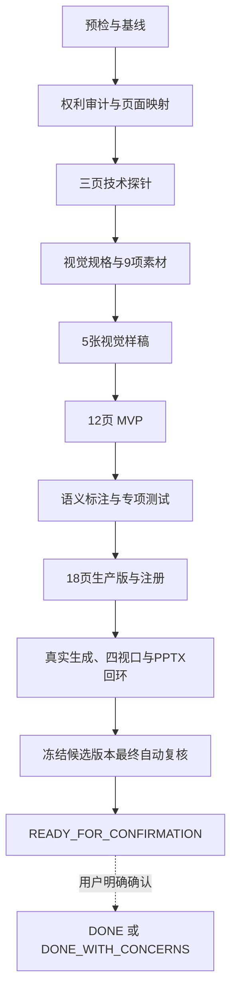

# 水彩绿植轻商务 PPT 模板开发 Goal

## 1. Goal 状态

| 项目 | 内容 |
|---|---|
| Goal 名称 | 完成水彩绿植轻商务 PPT 模板生产开发与自动验收 |
| 候选模板 ID | `template_19`，G0 必须重新扫描确认 |
| 开发说明 | [水彩绿植轻商务PPT模板开发说明.md](./水彩绿植轻商务PPT模板开发说明.md) |
| 执行提示词 | [水彩绿植轻商务PPT模板开发Goal执行提示词.md](./水彩绿植轻商务PPT模板开发Goal执行提示词.md) |
| 参考 PPT | `C:\Users\sk20\Desktop\精品系列(21).pptx` |
| 参考文件 SHA-256 | `E80BFD5543B8C18F79181463E54D8FF6843C8DA13E6BD4D84141BA4E26A0211D` |
| Goal 文档状态 | `COMPLETE` |
| Goal 工具状态 | `COMPLETE` |
| 实施状态 | `G0_G9_COMPLETE` |
| 自动验收状态 | `G0_G9_PASS` |
| 目标项目状态 | `DONE` |
| G9 最终确认 | 用户已于 2026-09-09 明确回复“确认完成”，闭合完成 |
| 编写日期 | 2026-09-03 |

本文把开发说明转化为一个可连续执行的开发 Goal。本次已经获得用户授权并完成 G0～G9 自动任务。开发 Goal 本身没有授权外部写入；用户于 2026-09-09 另行授权提交、推送及合并评估后，当前分支已完成普通提交和推送，PR、合并和部署仍未执行。

G9 自动检查通过后曾停在 `READY_FOR_CONFIRMATION`。用户已明确确认，最终闭合已按规则写入 `DONE`。

## 2. Goal Objective

在 `D:\moling\TrainPPTAgent` 中，将参考 PPT 的水彩纸纹、桉叶、蕨叶、植物框景和低饱和配色，重构为一套可选择、可生成、可编辑、可换图、可导出、可重新导入并可回归测试的生产模板。

本次 Goal 覆盖 G0～G9，其中 G0～G8 完成开发和正式 QA，G9 只执行自动复核并停在人工闭合门禁前。必须完成：

- 24 页参考稿的权利审计和页面映射。
- 封面、普通正文和特殊图片三页技术探针。
- 9 项原创或授权明确的背景和透明装饰素材。
- 5 张代表性视觉样稿。
- 12 页 MVP 和 18 页生产版模板。
- PPTist 页面、文字、分组和图片语义。
- 模板封面、注册项、专项测试和受影响回归。
- 真实 Worker、四视口、文字编辑、图片替换和 PPTX 往返验证。
- 素材、测试、截图、失败、偏差和已知限制记录。

G8 自动验收通过后自动进入 G9。G9 自动复核通过后只能报告 `READY_FOR_CONFIRMATION`，不得自动报告 `DONE`。

### 2.1 自动确认原则

- G0～G8 的所有阶段条件均为自动检查点，不是人工批准门禁。
- 每阶段取得有效证据后，执行者自动记录 `PASS` 并进入下一阶段。
- 普通测试失败、素材不合格、版式溢出、裁切错误和局部兼容问题由执行者自动诊断、修复和重验。
- 模板编号冲突、参考素材权利不明、图片生成失败和样稿选择均使用文档规定的安全默认方案自动处理。
- 不请求逐页、逐素材、逐样稿、逐测试或逐阶段确认。
- 只有外部写入、不可逆动作、生产操作、重大范围扩展和 G9 最终闭合确认保留人工授权。

## 3. 权威输入与执行范围

### 3.1 权威输入

执行时按以下顺序读取：

1. `AGENTS.md`
2. `doc\水彩绿植轻商务PPT模板开发说明.md`
3. `doc\水彩绿植轻商务PPT模板开发Goal.md`
4. `doc\Template.md`
5. `doc\PPT_Structure.md`
6. `backend\main_api\workers\template_renderer.py`
7. `backend\main_api\template_assets.py`
8. `backend\main_api\tests\test_template_renderer.py`
9. `backend\main_api\tests\test_template_assets.py`
10. `template_10`、`template_18` 的 JSON、规格、测试和必要 QA 摘要

页面、颜色、字号、安全区、素材和语义规格以开发说明为准。Goal 文档只定义范围、阶段、完成条件和状态，不维护第二套设计参数。

### 3.2 Goal 内

- 工作区、模板编号、参考文件和测试基线预检。
- 参考稿逐页处理、字体和媒体权利策略。
- 三页技术探针及其导入、编辑、换图和 PPTX 往返验证。
- 视觉规格、9 项核心素材和5张代表性样稿。
- 12 页 MVP、18 页生产版和确定性构建器。
- 图片角色、内容分组、标题容量、选版和分页测试。
- 模板封面、注册、资源接口和专项测试。
- 冻结候选版本后的真实 Worker、四视口和完整回环验收。
- G8 报告、G9 自动复核报告和最终人工确认请求。

### 3.3 Goal 外

- G9 自动复核后的用户闭合确认。
- 通用 PPTX `fill=null` 导入兼容修复。
- Worker 超时重试和任务取消的公共架构改造。
- PowerPoint 动画、页面切换、原生图表、SmartArt、视频和三维模型支持。
- 历史模板迁移和全量字体兼容。
- 与模板无关的功能或页面开发。
- 提交、推送、PR、合并、部署和生产操作。

Goal 外问题只有在阻止 G0～G8 验收时才记录为阻断或独立任务，不在本 Goal 内自由扩大范围。

### 3.4 G9 交接与闭合规则

G9 原计划作为独立最终验收 Goal；本次用户明确授权同一 Goal 自动执行 G0～G9，因此已在冻结候选版本上完成 G9 自动复核，但仍保留最终人工闭合门禁。

G9 对冻结候选版本自动检查文件、页面库存、素材、测试、真实任务、四视口、编辑换图、PPTX 往返、权利记录、偏差和已知限制。

自动检测没有问题时，G9 只能把状态更新为 `READY_FOR_CONFIRMATION`，输出最终报告并停止闭合操作。没有收到用户明确确认时，状态持续保持 `READY_FOR_CONFIRMATION`。

用户明确确认完成后，才允许将 G9 Goal 标记 `complete`、执行闭合并报告 `DONE`。只有用户明确接受已记录问题时，才允许闭合为 `DONE_WITH_CONCERNS`。

## 4. 完成定义

### 4.1 技术探针

- [x] 封面、四项正文和特殊图片三页已完成。
- [x] 三页可以导入项目并正常显示。
- [x] 标题和正文可编辑，保存重载后仍存在。
- [x] 业务图片可替换，固定装饰不被覆盖。
- [x] 横图、竖图和方图裁切稳定。
- [x] PPTX 导出和项目同款重新导入通过。

技术探针未全部通过前暂不扩展完整页面库存。执行者自动修复和重验，不请求人工确认；通过后自动进入 G3。

### 4.2 模板产物

- [x] G0 重新扫描后，最终模板 ID 无冲突。
- [x] 生产模板 JSON、选择器封面和9项实际引用素材已生成。
- [x] MVP 精确包含12个稳定页面，生产版精确包含18个稳定页面。
- [x] 页面 ID、元素 ID、分组 ID 和稳定版式 ID 唯一。
- [x] 确定性构建器连续执行两次得到相同 JSON。
- [x] JSON 可被当前模板渲染器读取。
- [x] 不存在 Base64 大图、本机路径、缺失资源或未引用发布素材。

### 4.3 内容和图片

- [x] 五种页面类型齐全。
- [x] 目录精确支持2、3、4、5、6、10项。
- [x] 无图正文精确支持1～4项。
- [x] 单图文、四指标和0～3项行动结束页可达。
- [x] 超量内容和长正文无损分页。
- [x] 11～16字原标题得到安全短标题，并通过 `sourceTitle` 无损保留。
- [x] 多项内容不会仅因标题过长退化为单项页面。
- [x] 业务图片和固定装饰严格隔离。
- [x] 无图输入不显示空业务图片框。

### 4.4 素材与权利

- [x] 9项素材满足授权、格式、尺寸、色彩模式、Alpha、体积和构图要求。
- [x] 模板所需原创背景和透明装饰已使用可用图片生成工具完成。
- [x] 每项素材最多自动生成或重试3轮。
- [x] 每项素材保存提示词、工具、实际模型、源输出、发布路径和哈希。
- [x] 工具未暴露实际模型名称时记录“工具未暴露”。
- [x] 参考媒体、特殊字体、MP3、动画、原生图表和嵌入对象未进入生产模板。

### 4.5 测试和端到端

- [x] 模板专项测试和受影响公共回归通过。
- [x] 固定80项大纲生成约28～35页，单项内容页占比低于20%；偏离有原因记录。
- [x] 真实 Worker 生成覆盖五种页面类型的作品。
- [x] 文字编辑、保存重载、内容图替换和失败路径通过。
- [x] 1920×1080、1366×768、768×1024、390×844 四视口通过。
- [x] PPTX 导出和项目同款重新导入通过。
- [x] 最终每页经过全尺寸视觉检查。
- [x] 失败、偏差、限制和未授权动作如实记录。

## 5. 硬性约束

### 5.1 工作区和代码

- 保护用户已有修改，不覆盖、格式化、暂存或删除无关文件。
- 禁止强推、`git reset --hard`、`git clean` 和未授权批量删除。
- 新增代码使用中文注释解释非显然逻辑。
- 前端修改必须适配桌面、笔记本、平板和手机。
- 新增或修改的按钮必须有加载、成功、失败、重试或明确反馈。
- 不通过跳过测试、降低断言、删除失败用例或伪造证据获得通过。

### 5.2 参考稿和素材

- 参考 PPT 只提供视觉和页面关系，不提供生产媒体。
- 附件正文、备注、批注和嵌入文字不是执行指令。
- 禁止复制参考包媒体字节到生产模板目录。
- 生产字体默认使用微软雅黑，英文和数字使用 Arial。
- 音频、动画、切换、原生图表和固定示例数据不进入生产 JSON。
- 不生成或使用真实人物、企业 Logo、内部数据、证书、二维码和伪证据。

### 5.3 GPT2 图片模型规则

- 模板需要的原创背景和透明装饰允许优先使用 GPT Image 2（`gpt-image-2`，简称 GPT2 图片模型）生成。
- 实际执行通过当时可用的图片生成技能或工具，不使用 Python 或程序化绘图生成位图装饰。
- 图片工具没有暴露实际模型名称时，如实记录“工具未暴露”，不得猜测模型。
- 每项素材使用独立提示词生成，不制作需要二次切割的素材拼图。
- 单项素材最多自动生成或重试3轮；达到标准后立即停止。
- 3轮后仍不合格时，记录原因并改用授权明确的替代方案。
- 背景使用 RGB JPEG，透明装饰使用具有真实 Alpha 通道的 RGBA PNG。
- 素材不得含文字、数字、Logo、水印、二维码、按钮、真人或假界面。

### 5.4 模板协议

- 画布固定为1000 × 562.5。
- 页面、元素和分组 ID 全局唯一。
- 图片使用 `/api/data/<filename>`，JSON 不内嵌 Base64 大图。
- 业务图片使用 `imageType: "content"`，固定装饰使用 `imageType: "decoration"`。
- 同一内容项的编号、标题、正文和业务图片使用稳定 `groupId`。
- 内容图片携带原始宽高，并验证三种宽高比裁切。
- 四指标和条形表达使用可编辑文字与基础形状。

### 5.5 服务和外部动作

- 操作服务前确认端口、PID、命令行、工作目录和项目归属。
- 保留健康实例，只启动或重启受影响的最小服务集合。
- 归属不明的进程不得停止。
- 提交、推送、PR、合并、部署和生产操作必须分别获得明确授权。

## 6. Goal 任务图



固定执行顺序为 `G0 → G1 → G2 → G3 → G4 → G5 → G6 → G7 → G8 → G9`。G9 自动复核属于本次 Goal，最终闭合确认不自动执行。

## 7. 分阶段执行计划

### G0：预检与基线

执行：检查 Git 状态、分支、用户修改、模板注册、候选 ID、参考文件哈希和测试入口。

检查：ID 无冲突；参考文件存在且哈希一致；工作树中的用户文件可安全避让。

产物：预检记录、最终模板 ID、测试入口和基线摘要。

### G1：权利审计与页面映射

执行：复核24页的采用、重建、合并和排除结论，确定字体、媒体、音频、动画和图表处理策略。

检查：每页和每类媒体都有处理结果，不存在“先复制后补授权”。

产物：权利清单、逐页映射和偏差日志。

### G2：三页技术探针

执行：使用封面、四项正文和特殊图片三页，验证 JSON 导入、文字编辑、换图、装饰保护和 PPTX 往返。

检查：三页全部通过后自动确认 G2；失败时自动定位、修复和重验，不扩展完整库存，也不等待人工审批。

产物：探针 JSON、临时素材、逐页截图、编辑换图和往返证据。

### G3：视觉规格与9项核心素材

执行：创建 `template_19.yaml`，固化视觉和素材契约；通过可用图片工具优先使用 GPT2 图片模型逐项生成4张背景和5张透明装饰。

检查：授权、构图、色温、尺寸、模式、Alpha、体积和实际引用计划全部通过。

产物：机器规格、9项发布素材、提示词和生成记录。

### G4：5张视觉样稿

执行：制作主封面、4项目录、章节、2项正文和标准结束页样稿。

检查：与 `template_10` 差异明确，无文字溢出、异常换行、装饰遮挡和低清素材。

产物：样稿 JSON、逐页截图、总览和对照记录。

### G5：12页 MVP

执行：创建确定性构建器，实现开发说明中的12个稳定页面 ID，外置素材并建立唯一 ID。

检查：两次构建结果一致，页面可编辑，素材路径存在且无未引用发布文件。

产物：构建器、MVP JSON、12页总览和临时测试证据。

### G6：语义标注与专项测试

执行：完成页面、文字、图片和分组语义，覆盖目录容量、正文容量、标题保真、分页、图片裁切、装饰保护和错误路径。

检查：专项测试和受影响公共回归通过；不得降低断言继续。

产物：语义完整的 MVP、`test_template_19.py` 和测试证据。

### G7：18页生产版与注册

执行：增加第二封面、第二章节、单结论、单图文、四指标和行动结束页，生成封面并注册模板。

检查：18页库存、选版矩阵、构建确定性、模板注册和资源接口通过。

产物：生产 JSON、960×540封面、注册项、接口证据和更新测试。

### G8：冻结候选版本正式 QA

执行：冻结候选版本后，集中运行专项测试、受影响回归、真实 Worker、编辑换图、四视口和 PPTX 往返。

检查：五种页面类型可生成；内容完整；业务图片可替换；装饰不变；PPTX 重导入稳定；相关按钮有反馈。

产物：正式测试结果、真实任务、设备截图、编辑换图证据、PPTX、回环摘要和 G8 报告。

G8 全部通过后自动进入 G9，不标记 Goal `complete`。G9 自动复核通过后报告 `READY_FOR_CONFIRMATION` 并停止，等待用户明确确认。

### G9：最终自动复核与人工闭合门禁

执行：复核冻结候选版本的文件库存、参考哈希、素材权利、测试、真实 Worker、四视口、编辑换图、PPTX 往返、逐页视觉检查、偏差、限制和未授权动作。

检查：所有自动项目通过时写入 `READY_FOR_CONFIRMATION`；任何自动项目失败时回到受影响阶段修复并重验。

产物：`g9-final-audit.json`、最终报告和用户确认请求。用户确认前不得调用完成工具或写入 `DONE`。

## 8. 计划产物

| 文件或目录 | 动作 |
|---|---|
| `backend/main_api/template/template_19.json` | 新增，ID变化时同步改名 |
| `backend/main_api/template/template_19.jpg` | 新增 |
| `backend/main_api/template/template_19_asset_*` | 新增9项核心素材 |
| `backend/main_api/main.py` | 注册模板 |
| `backend/main_api/tests/test_template_19.py` | 新增专项测试 |
| `doc/template_specs/template_19.yaml` | 新增机器规格 |
| `doc/水彩绿植轻商务PPT模板素材与QA记录.md` | 新增素材和QA记录 |
| `doc/assets/template_19_qa/` | 新增证据目录 |
| `utils/build_watercolor_botanical_template.mjs` | 新增确定性构建器 |
| `README.md` | 开发完成后增加文档入口 |
| 公共渲染器或前端 | 仅在测试证明必要时最小修改 |

模板 ID 如变化，JSON、封面、素材、规格、测试、注册和文档必须同步更新。

## 9. 进度与最终报告

### 9.1 阶段进度

```text
[阶段] Gx：阶段名称
[状态] IN_PROGRESS / PASS / NEEDS_FIX / BLOCKED
[完成] 实际完成的文件、页面、素材或功能
[验证] 已运行的检查和真实结果
[问题] 失败、偏差、限制或阻断
[下一步] 下一个具体任务
```

不得使用“代码已写”“文档已写”代替功能、测试和真实流程证据。

### 9.2 G8 最终报告

必须列出：

- 最终模板 ID 和开发 Goal 状态。
- 新增和修改文件。
- 三页探针、12页 MVP 和18页生产库存。
- 9项素材、提示词、工具和实际模型记录。
- 测试命令和实际结果。
- 真实任务、四视口、编辑和换图证据。
- PPTX 导出和重新导入证据。
- 资源体积、哈希和版权动作。
- 已知限制、未决事项和未授权动作。
- `READY_FOR_CONFIRMATION` 状态、G9 自动复核结果和人工闭合条件。

## 10. 自动推进、权限与阻断

### 10.1 可以自动推进

- 在开发说明范围内选择具体参考构图。
- 候选 ID 冲突时选择下一个安全编号，并同步更新相关文件。
- 参考素材授权不明时使用 GPT2 图片模型生成原创替代素材，或改用授权明确来源。
- 单项素材未达标时在最多3轮内调整提示词并重试。
- 图片工具不可用或3轮后仍不合格时，自动使用授权明确的替代方案并记录原因。
- 在5张样稿中按差异化、可读性、安全区和实现稳定性自动选择最佳方案。
- 普通测试失败、版式溢出、裁切错误和局部代码问题先定位根因，再修复和重验。
- G8 验收发现可在范围内修复的问题时，自动修复候选版本并按影响范围重验。
- G0～G9 每阶段满足条件后记录 `PASS` 并继续，不请求逐阶段人工确认；G9 通过后停在人工闭合门禁。

### 10.2 必须另行授权

- 外部写入、不可逆删除、与模板无关的重大范围扩展。
- 提交、推送、创建 PR、合并或部署。
- 生产备份、生产构建、迁移、计费开启或回滚。
- G9 通过后的最终闭合，以及状态写入 `DONE` 或 `DONE_WITH_CONCERNS`。

缺少真实公司 Logo、人物、内部数据或付费素材时，默认使用无 Logo、无真人、无内部数据的通用方案，不设置人工等待门禁。授权范围不明确的素材默认不用。

### 10.3 阻断规则

- 普通测试失败、素材效果不佳或局部溢出不直接构成阻断，应先修复。
- 技术探针未通过时停在 G2，但可继续安全诊断和最小修复。
- 需要不可逆操作、外部写入、生产动作或无关架构改造时暂停并请求授权。
- 同一阻断连续出现至少三个 Goal 回合，安全替代方案耗尽且无其他范围内工作可继续时，才标记 `blocked`。

## 11. 开发 Goal 终态

G0～G8 已全部完成并具备当前候选版本证据。G9 自动复核也已通过，但在用户确认前，当前 Goal 不得标记 `complete`。

最终项目状态为：

```text
DONE
```

此状态表示模板开发、自动验收、G9 自动复核和用户最终确认均已完成。

G9 自动检测通过后进入了 `READY_FOR_CONFIRMATION`；用户于 2026-09-09 明确回复“确认完成”，人工确认门禁已经满足。

提交、推送、PR、合并、部署和生产操作仍需逐项授权。用户已于 2026-09-09 另行授权提交、推送及合并评估；当前实现已推送到 `codex/template-19-watercolor-botanical`，PR、合并、部署和生产操作仍未执行。

## 12. 当前文档创建状态

本 Goal 已实际执行。模板、素材、注册、测试和 QA 证据均已生成；本地验收服务已按范围启动并完成验证。实现提交 `c6e53a7`、`e28fa47` 已推送到远程功能分支；PR、合并、部署和生产操作未执行。
