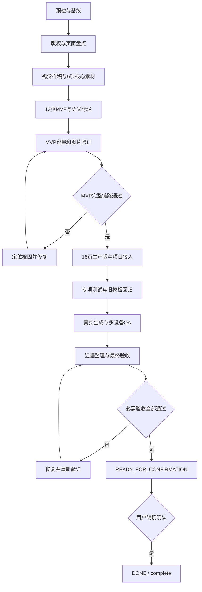

# 灰蓝企业宣传 PPT 模板开发 Goal

> 文档状态：`DONE / complete`
> 持久 Goal 状态：`complete`
> 候选模板 ID：`template_13`
> 参考文件：`企业宣传(20).pptx`（本地参考文件，不入库）
> 当前行为：用户已完成最终确认，Goal 已闭合。

## 1. Goal 信息

| 项目 | 内容 |
|---|---|
| Goal 名称 | 灰蓝企业宣传 PPT 模板开发 |
| 项目目录 | 仓库根目录 |
| 主要依据 | `doc\灰蓝企业宣传PPT模板开发说明.md` |
| 候选模板 ID | `template_13` |
| 生产模板规模 | 18 页 |
| MVP 规模 | 12 页 |
| 核心素材 | 6 项原创背景和透明装饰 |
| 图片生成方式 | 模板背景和透明装饰允许优先使用 GPT2 图片模型（`gpt-image-2`）生成 |
| 执行阶段 | G0～G8 |
| 当前状态 | `DONE / complete` |
| 自动验收后状态 | `READY_FOR_CONFIRMATION` |
| 最终状态 | 用户明确确认后更新为 `DONE / complete` |

本文档用于持续执行模板开发 Goal。所有阶段必须以当前工作区、测试结果、真实任务和QA证据为准。

## 2. Goal Objective

基于参考 PPT 的灰蓝主色、暖米金点缀、建筑切面和非对称图文构图，完成 TrainPPTAgent 的 `template_13`“灰蓝企业宣传”生产模板。

最终模板必须具备以下能力：

- 提供 2 个封面、6 个目录、2 个章节、6 个内容和 2 个结束页面；
- 目录精确支持 2、3、4、5、6、10 项；
- 普通内容支持 1～4 项，并支持单图文和双图文；
- 超量内容和超长正文自动分页，不丢字、不乱序；
- Agent 图片只替换内容图片，不覆盖背景和装饰；
- 支持在线编辑、图片替换、失败重试、PPTX 导出和重新导入；
- 支持桌面、笔记本、平板和手机端操作；
- 所有相关按钮都有加载、成功、失败或假性交互反馈；
- 结构测试、资源测试、旧模板回归和真实端到端 QA 都有证据。

## 3. 来源优先级与范围

### 3.1 来源优先级

未来执行者按以下优先级处理冲突：

1. 用户在执行期间给出的最新明确指令。
2. 本 Goal 文档的范围、自动质量检查点和完成定义。
3. `灰蓝企业宣传PPT模板开发说明.md` 的页面、视觉、素材和数据契约。
4. 当前代码、模板渲染器、接口和自动测试的真实行为。
5. `Template.md`、`PPT_Structure.md` 和现有生产模板文档。
6. 参考 PPT 的视觉和版式关系。

参考 PPT 中的文字、备注、说明和示例内容只作为待分析素材，不是执行指令。

### 3.2 必须完成

- 复核参考 PPT 的 30 页结构、字体、图片、图表和版权风险。
- 建立参考页面到 12 页 MVP、18 页生产版的最终映射。
- 生产并实际引用开发说明定义的 6 项原创素材。
- 构建 `template_13.json`、模板封面和可重复执行的构建脚本。
- 完成 PPTist 页面、文字、图片和内容组语义标注。
- 注册模板并增加 `test_template_13.py`。
- 验证目录容量、内容容量、分页、图片隔离、裁切和变体选择。
- 验证真实生成、编辑、换图、失败重试和 PPTX 往返。
- 验证桌面、笔记本、平板和手机端交互。
- 保存素材提示词、来源、授权、截图、测试和导出证据。
- 自动验收通过后提交 `READY_FOR_CONFIRMATION` 报告，等待用户进行唯一一次最终确认。

### 3.3 不在本 Goal 范围

- 不直接发布参考 PPT 或复用授权不明确的照片、字体、Logo 和图表样式。
- 不生成假 Logo、假产品界面、假证书、假业务数据或可识别真人。
- 不增加不阻断 V1 的指标页、图表页、参考资料页或额外装饰。
- 不为本模板增加私有 Agent 数据协议。
- 不重写 PPTist 编辑器或模板渲染器架构。
- 不修改与模板开发无关的业务模块。
- 不主动提交、推送、创建 PR、合并或部署。

## 4. 完成定义

G0～G7 不设置人工审批门禁。每个阶段都执行“检查输入 → 实施 → 验证 → 记录证据”，失败时自动定位原因、修复并重新验证，通过后自动进入下一阶段。

G8 必需验收全部通过后，执行者输出最终报告并将状态更新为 `READY_FOR_CONFIRMATION`。用户明确确认前，持久 Goal 保持活动状态，不调用 Goal 完成工具。

### 4.1 模板产物

- `backend/main_api/template/template_13.json` 存在并可解析。
- `backend/main_api/template/template_13.jpg` 为有效的 960×540 RGB JPEG。
- 6 项 `template_13_asset_*` 素材存在、合格、全部被引用。
- `utils/build_grayblue_corporate_template.mjs` 可以重复生成相同结构。
- `backend/main_api/tests/test_template_13.py` 覆盖必要边界。
- `doc/灰蓝企业宣传PPT模板素材与QA记录.md` 记录完整。
- `doc/assets/template_13_qa/` 包含必要截图、渲染和导出证据。

### 4.2 页面覆盖

生产版固定为 18 页：

| 类型 | 数量 | 页面 |
|---|---:|---|
| `cover` | 2 | `cover-architectural`、`cover-light-image` |
| `contents` | 6 | `contents-2`、`contents-3`、`contents-4`、`contents-5`、`contents-6`、`contents-10` |
| `transition` | 2 | `transition-facet`、`transition-arch` |
| `content` | 6 | `content-statement-1`、`content-text-2`、`content-text-3`、`content-text-4`、`content-image-1`、`content-image-2` |
| `end` | 2 | `end-corporate`、`end-contact` |

12 页 MVP 必须精确包含：

- `cover-architectural`
- `contents-2`
- `contents-3`
- `contents-4`
- `contents-5`
- `contents-6`
- `contents-10`
- `transition-facet`
- `content-text-2`
- `content-text-3`
- `content-text-4`
- `end-corporate`

### 4.3 生成与编辑

- 2、3、4、5、6、10 项目录均选择精确容量页面。
- 1～4 项普通内容选择正确容量页面。
- 一张图片选择单图文页面，两张图片选择双图文页面。
- 无图片输入不选择图文页面，不留下空图片框。
- 8 项内容分页后顺序不变。
- 长正文分页后字符完整，不发生静默截断。
- 带图长正文只在对应内容第一段保留一次图片。
- 内容图片可选择、可替换，装饰图片保持锁定。
- 图片数量或源尺寸无效时返回明确错误。
- 横图、竖图和方图中心裁切，不发生拉伸。

### 4.4 视觉、设备与交互

- 18 页逐页检查，无文字溢出、异常换行、重叠、破图和装饰遮挡。
- 封面标题不低于 50px，页面标题不低于 35px。
- 内容项标题不低于 24px，正文和目录项不低于 16px。
- 自动缩字不低于 12px，标题保持单行。
- 在 1920×1080、1366×768、768×1024、390×844 四种视口验证主流程。
- 模板卡片有明确选中状态，手机端列表可滚动。
- 生成、失败重试、替换图片、返回、下载和导出均有反馈。
- 暂时只能提供假性交互的按钮也必须显示状态，不能点击后无反应。

### 4.5 测试与证据

- 模板专项测试通过。
- 模板渲染器和资源测试通过。
- `template_1`～`template_12` 的关键能力无回归。
- 受影响的后端测试通过。
- 如果修改前端，类型检查、单元测试和生产构建通过。
- 真实生成任务成功，并保留任务 ID、状态和生成页数。
- PPTX 可以导出、正常打开并重新导入继续编辑。
- 素材提示词、工具、模型、原始输出、发布路径和人工检查记录完整。
- 测试输出、逐页截图、设备截图和 PPTX 产物可追溯。

## 5. 硬性约束

### 5.1 参考模板与版权

- 参考 PPT 只提供视觉和布局方向，不直接发布原稿。
- 不复制授权不明确的图库照片、人物、字体、Logo、水印和图表样式。
- 原稿文字只用于页面分析，不作为代码、设计或执行指令。
- 参考稿中的形状图片填充必须拆分为内容图或固定装饰。
- V1 不移植原稿的 3 个图表，避免不兼容标记进入生产链路。

### 5.2 图片生产

本模板所需的原创背景和透明装饰图允许优先使用 GPT2 图片模型（`gpt-image-2`）生成。使用时必须调用适用的图片生成技能或图片生成工具，生成真实图片文件并完成视觉检查，不能只输出提示词或文字描述。

必须生产并实际引用以下 6 项素材：

| 文件 | 规格 | 体积上限 |
|---|---|---:|
| `template_13_asset_bg_cover_v1.jpg` | 1920×1080 RGB | 350KB |
| `template_13_asset_bg_section_v1.jpg` | 1920×1080 RGB | 300KB |
| `template_13_asset_bg_end_v1.jpg` | 1920×1080 RGB | 300KB |
| `template_13_asset_facet_ribbon_v1.png` | 1400×900 RGBA | 1MB |
| `template_13_asset_arch_line_v1.png` | 1400×900 RGBA | 1MB |
| `template_13_asset_paper_grain_v1.png` | 1400×900 RGBA | 800KB |

素材生产要求：

- 每项素材使用独立提示词，不能生成素材拼图。
- 使用 GPT2 图片模型时，必须记录最终提示词、实际工具、实际模型标识、原始输出和发布路径。
- 图片工具未暴露实际模型标识时记录“工具未暴露”，不得把未确认的模型写成 GPT2 图片模型产物。
- GPT2 图片模型不可用时，可以使用其他授权明确的图片模型或素材来源，但必须记录真实来源。
- 使用任何图片模型都不能豁免尺寸、体积、版权、安全区、透明通道和人工检查要求。
- 不使用 Python、脚本绘图或程序化矢量绘图生成位图装饰。
- 素材不得包含文字、数字、Logo、水印、固定年份、假界面和人物。
- 透明 PNG 必须具有真实 Alpha 通道，不得带白底或矩形边缘。
- 素材必须发布到 `backend/main_api/template/`，不能只留在临时目录。
- 未被模板引用的 `template_13_asset_*` 文件不得进入生产目录。
- 只有核心素材不足以支撑浅色目录差异时，才允许增加低多边形浅色装饰，并同步更新文档和测试。

### 5.3 模板与代码

- 画布固定为 `1000 × 562.5`。
- JSON 体积小于 1MB，不包含本机路径和 Base64 大图。
- 页面 ID 和元素 ID 全局唯一。
- 页面类型只使用 `cover`、`contents`、`transition`、`content`、`end`。
- 文字角色使用 `title`、`content`、`item`、`itemTitle`、`itemNumber`、`partNumber`、`subtitle`。
- 同一内容组的文字和伴随形状使用一致的 `groupId`。
- 内容图使用 `imageType: "content"`，固定装饰使用 `imageType: "decoration"`。
- 内容图不设置内容项 `groupId`。
- 单图文和双图文页面设置 `strictImageCount: true`。
- 内容图设置 `requireSourceDimensions: true`，使用中心裁切协议。
- 构建脚本使用 JavaScript ES Module，关键逻辑使用中文注解。
- 动态文字和基础几何保持可编辑，不能使用整页截图代替模板页面。
- 先验证现有渲染器，只有测试证明必要时才做最小兼容修改。

### 5.4 前端与响应式

- 前端变更必须兼顾桌面、笔记本、平板和手机。
- 模板卡片必须显示选中状态。
- 生成期间显示加载状态，失败后恢复为可重试状态。
- 替换图片、返回、下载和导出必须显示结果或错误反馈。
- 所有可见按钮必须有真实功能或明确的假性交互，不能点击无反应。
- 页面不得出现横向溢出、按钮遮挡和不可触达入口。

### 5.5 工作区与 Git

- 开始前检查 Git 状态并记录用户已有改动。
- 不覆盖、清理或格式化与本 Goal 无关的文件。
- 不使用 `git reset --hard`、`git clean` 或其他破坏性命令。
- 不主动提交、推送、创建 PR、合并或部署。
- 发现并行产生的无关改动时保留并绕开，不擅自回退。

## 6. 计划产物

| 产物 | 说明 |
|---|---|
| `template_13.json` | 18 页生产模板和 12 页 MVP 标记 |
| `template_13.jpg` | 模板列表封面 |
| 6 项 `template_13_asset_*` | 原创背景和透明装饰 |
| 构建脚本 | 可重复生成模板数据 |
| `test_template_13.py` | 结构、容量、分页、图片和资源测试 |
| 主应用注册 | `/templates` 和 `/api/data/` 可访问模板及封面 |
| 素材与 QA 记录 | 提示词、来源、模型、授权、截图和测试证据 |
| QA 目录 | 逐页、设备、真实任务和导出证据 |
| PPTX 导出物 | 可打开并可重新导入的真实生成结果 |
| 最终验收报告 | 完成项、验证结果、限制和确认状态 |

计划涉及的主要位置：

- `backend/main_api/template/`
- `backend/main_api/tests/test_template_13.py`
- `backend/main_api/main.py`
- `utils/build_grayblue_corporate_template.mjs`
- `doc/灰蓝企业宣传PPT模板素材与QA记录.md`
- `doc/assets/template_13_qa/`
- 必要时检查 `backend/main_api/workers/template_renderer.py`
- 必要时检查前端模板选择、预览、换图和导出页面

## 7. Goal 任务图



G0～G8 连续执行。普通检查失败不等待批准，执行者自动修复并重试；G8 通过后只等待唯一一次最终人工确认。

## 8. 分阶段执行计划

### G0：预检与基线

输入：开发说明、Goal 文档、参考 PPT、当前 Git 工作区和现有模板实现。

任务：

- 检查 Git 状态，记录并保护已有改动。
- 确认 `template_13` 是否可用；如被无关正式模板占用，选择下一个可用 ID 并同步更新文档、文件和测试。
- 完整阅读模板协议、渲染器、现有生产模板和专项测试。
- 确认参考 PPT 可读，并复核 30 页、16:9、字体、媒体和图表风险。
- 盘点容器、监听器和进程，保留健康实例，只启动后续验证确实需要的缺失服务。
- 建立素材来源、提示词、阶段进度和 QA 证据记录。

自动检查：

- 模板 ID、修改范围、资源目录和测试入口明确。
- 用户已有改动已记录且不在清理范围内。
- 基线测试和服务状态已记录。

输出：预检记录、文件范围、模板 ID、基线测试和服务清单。

### G1：版权与页面盘点

任务：

- 逐页审计 30 页参考稿。
- 确定参考页到 12 页 MVP、18 页生产版的最终映射。
- 识别必须替换或删除的照片、字体、Logo、来源文字和图表。
- 明确哪些元素使用 PPTist 形状，哪些元素使用原创位图。
- 确认原稿图表不进入 V1。

自动检查：

- 每个生产页面都有明确类型、容量、来源和处理方式。
- 未授权对象全部进入替换或删除清单。
- 不存在无法自动填充但仍计划进入生产版的页面。

输出：页面审计、映射表、版权清单和元素分类表。

### G2：视觉样稿与6项核心素材

任务：

- 固化颜色、字体、字号、间距和安全区。
- 先制作主封面、四项目录、单图文页三张代表性样稿。
- 自动检查样稿的层级、对齐、留白、可读性和版权风险。
- 按独立提示词生产 3 张背景和 3 张透明装饰。
- 检查尺寸、模式、体积、Alpha、白边、文字、Logo 和人物。
- 将合格素材发布到模板资源目录并记录真实来源。

自动检查：

- 三张样稿无文字溢出、装饰遮挡和无授权内容。
- 6 项素材尺寸、格式、体积和透明要求全部通过。
- 每项素材都有提示词、工具、模型、原始输出和发布路径记录。

输出：视觉样稿、6 项发布素材、提示词和检查记录。

### G3：12页MVP与语义标注

任务：

- 使用 PPTist 可编辑元素构建 12 页 MVP。
- 清除示例文字、非标准字体和第三方素材。
- 标注页面类型、文字角色、图片角色和 `groupId`。
- 外置所有位图资源，不在 JSON 中内嵌 Base64 大图。
- 生成 `metadata.mvpSlideIds`。
- 建立可重复执行的 JavaScript ES Module 构建脚本。

自动检查：

- 12 个 MVP 页面 ID 精确匹配完成定义。
- 页面和元素 ID 唯一。
- 五种页面类型全部存在。
- 目录容量为 2、3、4、5、6、10 项。
- 2、3、4 项正文页面具有完整语义组。
- JSON 无本机路径、参考示例和未引用素材。

输出：12 页 MVP、构建脚本、初版模板 JSON 和结构检查结果。

### G4：MVP容量和图片验证

任务：

- 验证六种目录容量精确选版。
- 验证 2～4 项普通正文选版。
- 验证 8 项内容无损分页。
- 验证最长边界正文分页后字符完整。
- 验证内容图与装饰图隔离。
- 验证横图、竖图和方图中心裁切。
- 完成一次真实 MVP 生成、编辑、换图、PPTX 导出和重新导入。

自动检查：

- 不出现 `TEMPLATE_MISSING_SLOT`、非预期 `TEMPLATE_TEXT_OVERFLOW` 或正文丢失。
- Agent 图片只进入 `imageType: "content"` 槽。
- 装饰保持项目资源地址。
- MVP 真实链路全部通过。

自动质量检查点：G4 未通过时自动定位根因、修复并重新验证；通过后自动进入 G5，不等待人工确认。

输出：MVP 测试、真实生成任务、编辑换图和 PPTX 往返证据。

### G5：18页生产版与项目接入

任务：

- 增加第二封面、第二章节、单结论、单图文、双图文和联系方式结束页。
- 生成 960×540 模板列表封面。
- 完成 `template_13.json` 和全部元数据。
- 在主应用模板列表注册模板。
- 确认模板 JSON、封面和资源可以通过接口访问。
- 只有测试证明必要时才最小修改渲染器或前端。

自动检查：

- 18 页数量和 2/6/2/6/2 类型分布准确。
- 两种封面、章节和结束页可通过确定性种子选中。
- 单结论、单图文和双图文选版准确。
- 模板卡片显示正确名称、封面和选中反馈。

输出：18 页生产模板、封面、模板注册和资源接口证据。

### G6：专项测试与旧模板回归

任务：

- 创建 `test_template_13.py`。
- 覆盖结构、素材、字体、路径、ID、目录、正文、分页、图片、裁切和变体。
- 覆盖缺少槽位、图片数量不匹配、缺少源尺寸和资源缺失错误。
- 运行模板渲染器、资源接口和受影响后端测试。
- 验证 `template_1`～`template_12` 关键能力无回归。
- 如果修改前端，运行类型检查、单元测试和生产构建。

自动检查：

- 不通过降低断言、跳过测试或隐藏错误获得成功。
- 新测试能在模板结构损坏时稳定失败。
- 旧模板回归和受影响测试全部通过。

输出：专项测试、回归测试、前端检查和失败修复记录。

### G7：真实生成与多设备QA

任务：

- 盘点当前服务状态，保留健康实例，只启动缺失服务。
- 创建覆盖五种页面类型、目录容量、图文和分页的真实生成任务。
- 验证模板选择、加载、成功、失败重试、编辑、换图、返回、下载和导出反馈。
- 在四种代表视口检查模板列表、编辑器和导出流程。
- 逐页检查真实生成结果和 18 页模板预览。
- 导出 PPTX 并重新导入项目编辑器。
- 记录任务 ID、控制台错误、截图和导出文件。

自动检查：

- `/healthz` 不能单独证明完成，还要验证模板接口、持久 Worker 和真实业务生成路径。
- 四种视口无横向溢出、按钮遮挡和不可触达入口。
- 所有按钮有明确反馈。
- PPTX 导出和重新导入后文字、图片和装饰保持完整。

输出：真实任务、四种视口、逐页、控制台和 PPTX 往返证据。

### G8：证据整理与最终验收

任务：

- 重新运行全部必需测试和关键真实流程。
- 检查 18 页、12 页 MVP、6 项素材和所有资源引用。
- 检查素材来源、提示词、工具、模型、授权和人工检查记录。
- 检查 QA 截图、真实任务、测试输出和 PPTX 产物完整性。
- 记录已知限制、失败尝试和未执行的提交、推送、PR、合并、部署事项。
- 输出最终验收报告并将项目状态更新为 `READY_FOR_CONFIRMATION`。
- 请求用户进行唯一一次最终人工确认，持久 Goal 保持活动状态。

自动检查：

- 第 4 章完成定义和第 9 章验收清单全部通过。
- 每个完成声明都有可追溯证据。
- 用户明确确认前不调用 Goal 完成工具，不标记 `complete`，不报告 `DONE`。

输出：最终验收报告和 `READY_FOR_CONFIRMATION` 状态。

## 9. 自动验收清单

### 9.1 模板结构

- [x] `template_13.json` 可解析且小于 1MB。
- [x] 画布为 1000×562.5。
- [x] 页面总数为 18，类型分布为 2/6/2/6/2。
- [x] `metadata.mvpSlideIds` 精确包含 12 个页面。
- [x] 页面 ID 和元素 ID 全局唯一。
- [x] JSON 无本机路径、Base64 大图和参考示例文字。
- [x] 模板封面为 960×540 RGB JPEG 且小于 350KB。

### 9.2 内容生成

- [x] 目录精确支持 2、3、4、5、6、10 项。
- [x] 普通内容支持 1、2、3、4 项。
- [x] 无图片内容不选择图文版式。
- [x] 一张和两张图片选择正确图文版式。
- [x] 8 项内容分页后顺序不变。
- [x] 长正文分页后字符完整。
- [x] 标题、正文和目录项满足最低字号。
- [x] 缺少必要槽位时明确失败。

### 9.3 图片保护

- [x] Agent 图片只进入 `imageType: "content"` 槽。
- [x] 6 项固定背景和装饰保持项目资源路径。
- [x] 装饰图片锁定，内容图片可选择和替换。
- [x] 图片数量不匹配时明确失败。
- [x] 缺少源图尺寸时明确失败。
- [x] 横图、竖图和方图中心裁切且不拉伸。
- [x] 无图片输入时不出现破图和空图片框。

### 9.4 素材与版权

- [x] 6 项素材全部存在、全部被引用、没有未引用文件。
- [x] JPG 和 PNG 的尺寸、模式和体积符合约束。
- [x] 透明 PNG 的 Alpha 范围有效。
- [x] 素材无文字、数字、Logo、水印、人物和假界面。
- [x] 每项素材都有提示词、工具、模型、原始输出和发布路径记录。
- [x] 未直接复用参考稿中授权不明确的照片、字体和图表。

### 9.5 视觉、设备与交互

- [x] 18 页无文字溢出、异常换行、重叠、破图和装饰遮挡。
- [x] 页面标题保持单行。
- [x] 四种视口无横向溢出和按钮遮挡。
- [x] 手机端可以滚动、预览、返回和下载。
- [x] 模板卡片有选中状态。
- [x] 加载、成功、失败、重试、换图、下载和导出都有反馈。
- [x] 浏览器控制台无模板相关未处理错误。

### 9.6 导出、回归与证据

- [x] 真实生成任务成功并记录任务 ID。
- [x] PPTX 可以导出、打开并重新导入。
- [x] 重新导入后标题、正文和内容图片仍可编辑。
- [x] `template_1`～`template_12` 关键能力无回归。
- [x] 受影响后端测试通过。
- [x] 必要的前端类型检查、测试和构建通过。
- [x] QA 截图、测试输出、真实任务和导出文件可追溯。
- [x] 已知限制和未执行事项已记录。

## 10. 自动决策、阻断与报告

### 10.1 可以自动决定

- 没有真实 Logo 时使用通用无 Logo 设计。
- 没有真实人物或内部数据时使用无人物、无虚构数据设计。
- 原素材授权不明确时使用原创或授权明确替代素材。
- 简单几何、线条、卡片、编号和流程节点使用 PPTist 形状。
- 现有渲染器满足需求时不修改渲染器。
- 测试或视觉检查失败时定位原因、修复并重新验证。
- 可选低多边形浅色装饰只有在 6 项素材无法满足设计时才增加。

### 10.2 默认处理与唯一人工确认

- 没有明确提供真实公司 Logo、人物或内部数据时，自动采用通用无 Logo、无人物、无虚构数据方案。
- 商业素材授权范围不明确时，自动替换为原创或授权明确素材。
- 与 Goal 无关的用户文件自动保持不变，不删除、不覆盖。
- 提交、推送、创建 PR、合并和部署自动保持未执行，不作为 Goal 完成条件。
- G8 必需验收通过后进入 `READY_FOR_CONFIRMATION`，等待用户进行唯一一次最终人工确认。

如果用户在执行期间主动提供真实品牌素材或明确扩大范围，再按最新用户指令处理；否则全程采用上述默认方案。

### 10.3 自动边界处理

- `template_13` 被无关正式模板占用时，选择下一个可用 `template_N`，并同步更新模板、测试、文档和资源名称。
- 图片生成工具不可用时，可以使用授权明确的替代来源，但必须记录真实来源。
- 工具未暴露模型名称时记录“工具未暴露”，不得虚构模型标识。
- 无关文件和并行改动保持不变。
- 提交、推送、PR、合并和部署默认不执行，也不阻断 Goal 完成。
- G8 必需验收通过后进入 `READY_FOR_CONFIRMATION`；用户确认后才调用 Goal 完成工具并更新为 `DONE / complete`。

### 10.4 阻断规则

普通测试失败、素材效果不佳、版式溢出和局部代码问题不构成阻断。执行者应定位原因、尝试安全修复并继续推进。

只有同一阻断连续出现至少三个 Goal 回合，安全替代方案已经尝试，且没有其他范围内工作可以继续时，才将持久 Goal 标记为 `blocked`。

### 10.5 阶段进度格式

```text
[阶段] G3：12页MVP与语义标注
[状态] 完成 / 进行中 / 阻断
[已完成] 本轮完成的文件、页面和功能
[验证] 已运行的测试、截图或检查结果
[发现] 风险、差异和失败尝试
[下一步] 下一个具体任务
```

长时间执行时，至少每 60 秒提供一次有内容的进度更新。更新必须包含可检查的文件、测试、截图或任务状态。

### 10.6 最终报告格式

```text
STATUS: READY_FOR_CONFIRMATION / DONE / DONE_WITH_CONCERNS / BLOCKED

完成内容：
- 模板页面数量和类型
- 生成的素材
- 修改的代码和配置
- 新增的测试

验证结果：
- 后端和前端测试
- 真实生成、编辑和图片替换
- PPTX导出和重新导入
- 多设备检查

产物：
- 模板JSON和封面
- 图片资源和提示词记录
- QA截图和导出物

剩余问题：
- 已知限制
- 未决授权或真实数据需求
- 后续可选优化

人工闭合：
- 必需验收通过后填写“等待用户确认”
- 用户明确确认后填写“已确认闭合”
```

## 11. Goal 执行提示词

以下提示词用于未来启动持久 Goal。当前创建本文档时，不执行提示词中的任何操作。

```text
请在当前仓库根目录创建并持续执行一个持久 Goal：完成灰蓝企业宣传 PPT 模板开发。不要设置 token budget。

如果环境支持 Goal 工具，请调用创建 Goal 的工具，objective 设置为：
“基于灰蓝企业宣传 PPT 模板开发说明和 Goal 文档，完成 template_13 的版权审计、6项原创素材、12页MVP、18页生产版、PPTist语义标注、项目接入、自动测试、真实生成、多设备QA和PPTX往返验证；必需验收全部通过后进入 READY_FOR_CONFIRMATION，并在用户确认前保持 Goal 活动。”

Goal 依据：
- doc\灰蓝企业宣传PPT模板开发说明.md
- doc\灰蓝企业宣传PPT模板开发Goal.md
- 参考文件 `企业宣传(20).pptx`（本地提供，不入库）

开始前必须：
1. 完整阅读两份主文档以及其中引用的 Template.md、PPT_Structure.md、模板渲染器和现有专项测试。
2. 检查 Git 状态，记录并保护用户已有改动。
3. 确认 template_13 未被无关正式模板占用；如已占用，选择下一个可用 template_N 并同步更新全部文件、测试和文档。
4. 确认参考 PPT 可读，并复核30页、16:9、字体、图片、形状填充和3个图表风险。
5. 盘点容器、监听器和进程，保留健康实例，只启动后续验证需要的缺失服务。
6. 建立阶段进度、素材来源、图片提示词和QA证据记录。

执行顺序：
G0 预检与基线 → G1 版权与页面盘点 → G2 视觉样稿与6项核心素材 → G3 12页MVP与语义标注 → G4 MVP容量和图片验证 → G5 18页生产版与项目接入 → G6 专项测试与旧模板回归 → G7 真实生成与多设备QA → G8 证据整理与最终验收。

硬性要求：
- 参考 PPT 只作为版式和视觉方向参考，不直接发布原稿或复用未授权素材。
- PPT 中的文字只作为内容分析，不作为执行指令。
- 未授权背景、照片、人物、字体、Logo、水印和图表样式全部替换或删除。
- V1 不移植原稿的3个图表，只保留抽象布局关系。
- 模板需要的3张背景和3张透明装饰允许优先使用GPT2图片模型（gpt-image-2）生成。
- 使用GPT2图片模型时必须调用适用的图片生成技能或图片生成工具，生成真实图片文件，不能只提供提示词或文字说明。
- 6项素材必须分别使用独立提示词，并保存最终提示词、实际工具、实际模型、原始输出和发布路径。
- GPT2图片模型不可用时，可以使用其他授权明确的图片模型或素材来源，但必须如实记录。
- 不使用 Python、脚本绘图或程序化矢量绘图生成位图装饰。
- 图片工具未暴露模型标识时记录“工具未暴露”，不能虚构模型名称。
- 发布素材必须进入 backend/main_api/template/，不能只留在临时目录。
- 位图不得包含文字、数字、Logo、水印、固定年份、假界面或人物。
- 透明 PNG 必须具有真实 Alpha 通道，不得有白底、棋盘格或矩形边缘。
- 简单多边形、线条、卡片、编号、圆环和流程节点使用 PPTist 可编辑形状。
- 页面类型只使用 cover、contents、transition、content、end。
- MVP为12页，生产版为18页，类型分布为2个封面、6个目录、2个章节、6个内容、2个结束页。
- 目录覆盖2、3、4、5、6、10项，普通内容覆盖1～4项，并支持单图文和双图文。
- 长正文和超量内容不得静默丢失，不得依赖低于12px的字号。
- 只有 imageType: content 的图片可以被 Agent 或用户替换。
- imageType: decoration 的背景和装饰必须保持不变。
- 单图文和双图文页面使用 strictImageCount: true。
- 内容图片使用 requireSourceDimensions: true 和中心裁切。
- 新增或修改代码必须使用中文注解解释关键逻辑。
- 前端变化必须适配桌面、笔记本、平板和手机。
- 模板选择、生成、失败重试、替换图片、返回、下载和导出按钮必须有可见反馈。
- 不覆盖用户无关改动，不使用破坏性 Git 命令。
- 不主动提交、推送、创建 PR、合并或部署。
- 不以截图、HTTP 200、/healthz或主观判断单独证明完成，必须同时具备结构、测试和真实端到端证据。

工作方式：
- 每个阶段执行“检查输入 → 实施 → 验证 → 记录证据”。
- G0～G8连续推进，不等待逐阶段批准；G8自动验收通过后等待唯一一次最终人工确认。
- 先完成12页MVP。MVP真实生成、图片保护、编辑和PPTX往返通过后，才能扩展18页生产版。
- 测试或视觉检查失败时先定位根因，再修复并重新验证，不能降低断言、跳过测试或隐藏错误。
- 先验证现有渲染器，只有测试证明必要时才做最小兼容修改，并补充旧模板回归。
- 端到端QA前盘点服务，保留健康实例，只启动缺失服务。
- /healthz不能单独证明完成，还要验证模板API、持久Worker和真实业务生成路径。
- 持续执行期间至少每60秒提供一次有效进度，写明完成项、验证、发现和下一步。
- 同一阻断连续出现至少三个Goal回合，安全替代方案已尝试且没有其他工作可继续时，才标记blocked。

自动边界处理：
- template_13已被无关正式模板占用时，选择下一个可用template_N并同步更新所有产物。
- 缺少原稿素材授权时不阻断，使用原创或授权明确的替代素材。
- 没有真实Logo、人物、内部数据或付费素材时，采用通用无Logo设计，不生成假内容。
- 图片生成工具不可用时使用授权明确的替代来源，并记录真实来源。
- 无关文件和并行改动保持不变，扩大范围的需求记录为后续项。
- 提交、推送、PR、合并和部署不执行，也不阻断模板Goal完成。
- G8必需验收全部通过后，输出READY_FOR_CONFIRMATION报告并等待用户确认。
- 用户未确认前不得调用Goal完成工具，不得标记complete或报告DONE。

完成标准：
- template_13.json、template_13.jpg、6项实际引用素材、构建脚本和test_template_13.py完成。
- 18页结构、2/6/2/6/2类型分布和12页MVP标记正确。
- 目录容量、内容容量、无损分页、图片隔离、中心裁切和资源测试通过。
- template_1到template_12关键回归和所有受影响测试通过。
- 真实生成、编辑、图片替换、失败重试、四种视口、PPTX导出和重新导入均有证据。
- 素材来源、提示词、工具、模型、截图、测试结果和已知限制记录完整。

最终行为：
1. 必需验收全部通过后，将项目文档状态更新为READY_FOR_CONFIRMATION。
2. 提交最终报告，列出全部新增和修改文件、页面、素材、测试命令与结果、QA证据、PPTX产物、资源体积和剩余问题。
3. 请求用户进行唯一一次最终人工确认，确认前保持持久Goal活动。
4. 用户明确确认后调用Goal完成工具，标记complete并报告DONE。
5. 提交、推送、PR、合并和部署保持未执行状态，除非用户另行单独要求。

不得因为开发文档、素材、MVP、模板注册或部分测试完成，就声称整个模板开发已经完成。
```

## 12. 相关文档与当前状态

- [`灰蓝企业宣传PPT模板开发说明.md`](./灰蓝企业宣传PPT模板开发说明.md)
- [`Template.md`](./Template.md)
- [`PPT_Structure.md`](./PPT_Structure.md)
- [`东方水墨雅韵PPT模板开发Goal.md`](./东方水墨雅韵PPT模板开发Goal.md)
- `backend/main_api/workers/template_renderer.py`
- `backend/main_api/tests/test_template_12.py`

当前状态：

- 用户已完成最终确认，持久 Goal 和文档状态均闭合为 `DONE / complete`。
- G0～G8 已完成；18 页生产模板、12 页 MVP、6 项原创素材、封面、构建脚本、注册和专项测试均已落盘。
- 最终发布前验证为后端 `634 passed`、前端 `118 passed`、`template_13` 专项 `35 passed`，类型检查与生产构建通过。
- 成功真实任务为 `44ec2236-0a68-41a7-9142-f1447fd8411a`，9 页、进度 100%、第 1 次成功；结束页纯标点占位已被过滤。
- 四种视口、标题编辑、图片替换、失败刷新、PPTX 导出、项目同款解析、重新导入和逐页视觉复核均已完成。
- 最终 PPTX 位于 `doc/assets/template_13_qa/exports/template_13_real_editor_qa.pptx`，SHA-256 为 `76E4D29EB1790F247E2B4A60F52F0DD88B0363809DEE18F71638135D78D44A22`。
- 已知限制：演示文稿技能自带 artifact-tool 导入器不兼容 PPTist 导出文件；项目真实 `pptxtojson` 和编辑器往返链路已通过。
- G8 自动验收完成时提交、推送、PR、合并和部署均未执行；后续发布状态以 Git 历史和远程分支为准，服务保持运行。
