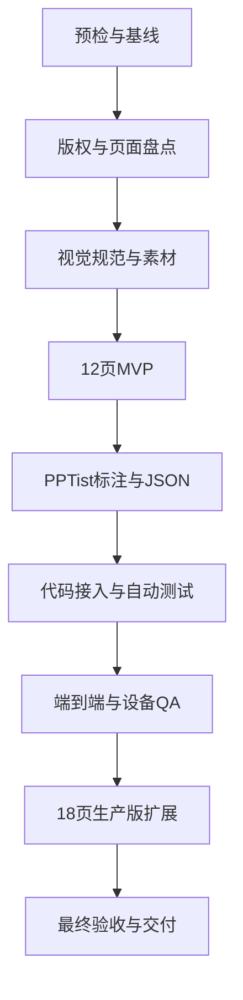

# 科技蓝扁平 PPT 模板开发 Goal

## 1. Goal 信息

| 项目 | 内容 |
|---|---|
| Goal 名称 | 完成科技蓝扁平 PPT 模板开发 |
| 工作目录 | `D:\moling\TrainPPTAgent` |
| 模板 ID | `template_8` |
| 模板名称 | 科技蓝扁平 |
| 参考 PPT | `C:\Users\sk20\Desktop\扁平风格(38).pptx` |
| 主开发文档 | [`科技蓝扁平PPT模板开发说明.md`](./科技蓝扁平PPT模板开发说明.md) |
| 当前状态 | `DONE`，G0～G8验收通过，用户已确认闭合 |
| 目标状态 | 自动验收通过后进入 `READY_FOR_CONFIRMATION`，用户确认后闭合为 `DONE` |
| 人工确认 | 用户于 2026-08-24 明确回复“确认完成” |
| Git 策略 | 不主动提交、推送、合并或部署 |

本文档定义未来 Goal 的执行顺序、完成标准、证据要求和人工边界。创建本文档不等于启动 Goal，也不代表模板已经开发。

> **图片生成说明：** 模板开发中需要的背景图和透明装饰图可以使用 GPT Image 2（`gpt-image-2`）生成。执行时必须保存提示词、模型名称、原始输出和项目发布路径；本说明仅定义允许的素材生产方式，当前没有生成任何图片。

## 2. Goal Objective

在 TrainPPTAgent 项目中完成 `template_8` 科技蓝扁平 PPT 模板的本地开发与验证。

最终模板必须使用原创或具有明确授权的素材，支持项目现有的五种基础页面类型，能够自动适配目录和内容数量，并通过生成、编辑、图片替换、响应式预览和 PPTX 导出验收。

Goal 执行完成后，用户应获得以下能力：

1. 模板选择页显示“科技蓝扁平”及正确封面。
2. 用户可以选择模板并生成完整 PPT。
3. 生成结果覆盖封面、目录、章节、内容和结束页。
4. 目录支持 2、3、4、5、6、10 项。
5. 内容页支持 1～4 项，超量或超长内容自动分页。
6. 支持纯文字、单图文和双图文页面。
7. AI 配图只替换内容图片，不替换背景和装饰。
8. 用户可以编辑文字和替换图片。
9. 用户可以导出 PPTX，并在项目编辑器中重新打开。
10. 桌面、平板和手机端可正常预览，所有按钮都有操作反馈。

## 3. Goal 范围

### 3.1 必须完成

- 盘点参考 PPT 的 27 页并确定选用页面。
- 清理示例文案、来源标识、非标准字体和未授权图片。
- 统一科技蓝扁平视觉规范。
- 生产必要背景和透明装饰素材。
- 完成 12 页 MVP。
- 在 PPTist 中完成页面与元素标注。
- 生成并整理 `template_8.json` 和 `template_8.jpg`。
- 扩展到 18 页生产版。
- 注册模板并增加专项测试。
- 完成真实生成、编辑、图片替换、设备适配和 PPTX 导出 QA。
- 保存素材来源、图片提示词、测试结果和截图证据。
- 输出最终验收报告，进入待确认状态并等待用户确认闭合。

### 3.2 不在本 Goal 范围

- 不重写 PPTist 编辑器。
- 不开发新的图表引擎。
- 不在首版增加独立 `reference` 页面。
- 不在首版增加专用流程页。
- 不修改 AI 大纲协议，除非现有协议无法完成基础页面。
- 不引入固定城市或科技内容照片，内容图由候选图片池提供。
- 不使用真实公司 Logo、真实人物或内部业务数据，除非用户另行提供并授权。
- 不提交、推送、合并或部署，除非用户另行授权。

## 4. 完成定义

Goal 不设置逐阶段人工门禁。第 4 章完成定义和第 9 章自动验收清单全部满足后，执行者生成最终报告并将 Goal 标记为 `READY_FOR_CONFIRMATION`。

检查失败时不得跳过、隐藏或降低标准。执行者应在当前阶段自动定位原因、修复并重新检查。自动验收通过后仍需用户明确确认，才可以标记 `DONE` 并执行闭合操作。

### 4.1 模板产物

- `backend/main_api/template/template_8.json` 已生成。
- `backend/main_api/template/template_8.jpg` 已生成。
- 必要的 `template_8_asset_*` 素材已保存到项目目录。
- 模板 JSON 可以被当前模板渲染器读取。
- 模板列表资源接口可以返回 JSON、封面和素材。
- 生产版包含 18 页，MVP 标记包含 12 页。

### 4.2 页面覆盖

生产版页面数量必须为：

| 类型 | 数量 |
|---|---:|
| 封面 `cover` | 2 |
| 目录 `contents` | 6 |
| 章节 `transition` | 2 |
| 内容 `content` | 6 |
| 结束 `end` | 2 |
| 合计 | 18 |

内容页必须覆盖：单结论、两项、三项、四项、单图文、双图文。

### 4.3 生成与编辑

- 封面标题和副标题进入正确槽位。
- 目录按 2、3、4、5、6、10 项选择对应版式。
- 1～4 项内容选择合适版式。
- 8 项内容能够分页，顺序和字符保持完整。
- 长正文不截断，不通过低于 12px 的字号勉强容纳。
- 内容图片可以被 AI 填充和用户替换。
- 背景和装饰不被 AI 图片覆盖。
- 无图片输入时不出现破图或异常空框。

### 4.4 视觉与设备

- 18 页逐页检查通过。
- 不存在文字越界、异常换行、破图、拉伸和装饰遮挡。
- 导出前后字体、换行、图片裁剪和装饰位置保持稳定。
- 1920×1080、1366×768、768×1024、390×844 四种视口无横向溢出。
- 模板选择、生成、失败重试、替换图片和导出按钮都有可见反馈。

### 4.5 测试与证据

- 模板专项测试通过。
- 现有渲染器回归测试通过。
- 前端类型检查、单元测试和生产构建通过。
- 真实生成结果、逐页截图和总览图已保存。
- PPTX 导出物已保存并重新导入验证。
- 素材来源、GPT Image 2 提示词和人工检查结果已记录。
- 所有测试失败、偏差和已知限制均已如实记录。

仅创建模板文件但未完成生成、编辑、导出和多设备验证，不算完成。

## 5. 硬性约束

### 5.1 参考模板和版权

- 参考 PPT 只作为版式和视觉方向参考。
- 未确认授权的城市照片、字体和模板来源标识不得进入生产模板。
- 所有新位图素材必须原创或具有明确授权。
- 不生成文字、Logo、水印、固定年份、真实人物和真实产品界面。
- 不生成可被误认为真实证据的证书、数据或截图。

### 5.2 图片生产

- 模板背景和透明装饰允许使用 GPT Image 2（`gpt-image-2`）生成。
- 执行时必须使用适用的图片生成技能或工具，不使用 Python 绘制位图装饰。
- 每种素材单独生成，不生成难以裁切的素材拼图。
- 保存最终提示词、模型名称、原始输出位置、项目发布路径和人工检查结果。
- 发布素材必须复制到 `backend/main_api/template/`。
- 背景使用 JPG，透明装饰使用具有真实 Alpha 通道的 PNG。
- 规则多边形、线条、圆环、卡片和普通粒子使用 PPTist 可编辑形状。

首版素材清单：

| 文件 | 要求 |
|---|---|
| `template_8_asset_bg_dark_v1.jpg` | 深色共用背景，1920×1080，小于 300KB |
| `template_8_asset_network_mesh_v1.png` | 透明网络装饰，只占页面边缘，小于 1MB |
| `template_8_asset_tech_glow_v1.png` | 透明青色光晕，不形成矩形底，小于 1MB |
| `template_8_asset_city_silhouette_v1.png` | 可选泛化城市剪影，无广告和真实标识 |

### 5.3 模板和代码

- 模板画布固定为 1000 × 562.5。
- 图片使用 `/api/data/` 地址，JSON 不内嵌 Base64 大图。
- 页面 ID 和元素 ID 必须唯一。
- 内容图片使用 `imageType: "content"`。
- 背景和装饰使用 `imageType: "decoration"`。
- 先验证现有渲染器，只有测试证明不足时才修改。
- 不得为了 `template_8` 破坏 `template_1`～`template_7`。
- 新增代码使用中文注解说明关键逻辑。
- 前端变更必须兼顾桌面、平板和手机。
- 可见按钮必须有交互反馈，不能点击后没有反应。

### 5.4 工作区和 Git

- 开始前检查 Git 状态并记录用户已有改动。
- 不覆盖、清理或格式化与本 Goal 无关的文件。
- 不使用 `git reset --hard`、`git clean` 等破坏性命令。
- 不主动提交、推送、合并、创建 PR 或部署。
- 只在 Goal 允许的文件范围内进行必要修改。

## 6. 计划产物

| 产物 | 说明 |
|---|---|
| `template_8.json` | 18 页生产模板 |
| `template_8.jpg` | 模板列表封面 |
| `template_8_asset_*` | 必要背景和透明装饰 |
| `test_template_8.py` | 模板结构和生成专项测试 |
| 素材与 QA 记录 | 提示词、来源、尺寸、测试和截图证据 |
| PPTX QA 导出物 | 真实生成结果的导出文件 |
| 最终验收报告 | 完成项、验证、限制和人工确认状态 |

计划涉及的主要位置：

- `backend/main_api/template/`
- `backend/main_api/main.py`
- `backend/main_api/tests/test_template_8.py`
- 必要时修改 `backend/main_api/workers/template_renderer.py`
- 必要时检查 `frontend/src/store/slides.ts`
- 必要时检查 `frontend/src/views/PPT/index.vue`
- `doc/科技蓝扁平PPT模板素材与QA记录.md`
- `doc/科技蓝扁平PPT模板开发说明.md`
- `doc/科技蓝扁平PPT模板开发Goal.md`

## 7. Goal 任务图



G0～G7 连续自动执行。各阶段检查点只用于自动发现问题，不暂停等待确认；检查失败时自动修复并重试。G8 自动验收通过后进入 `READY_FOR_CONFIRMATION`，等待用户确认闭合。

## 8. 分阶段执行计划

### G0：预检与基线

任务：

- 检查 Git 状态并记录已有改动。
- 阅读开发说明、模板协议、渲染器和现有模板测试。
- 检查 `template_8` 是否已经被占用。
- 确认前后端启动、模板导入和 PPTX 导出路径。
- 建立 Goal 进度、素材来源和 QA 记录位置。

自动检查（不暂停）：

- 允许修改的文件范围明确。
- 用户已有改动已记录并受到保护。
- 模板 ID、资源目录和测试入口明确。

### G1：版权与页面盘点

任务：

- 检查参考 PPT 的 27 页结构。
- 确认未授权图片、字体和来源文字的替换方案。
- 确定 12 页 MVP 和 18 页生产版映射。
- 排除没有清晰内容槽或与其他版式重复的页面。

自动检查（不暂停）：

- 每个生产页面都有明确类型、容量和参考页。
- 未授权内容全部列入替换或删除清单。

### G2：视觉规范与素材

任务：

- 固化颜色、字体、字号、边距和文字安全区。
- 使用 GPT Image 2（`gpt-image-2`）或其他明确授权来源生产必要位图。
- 检查透明通道、伪文字、边缘、构图和文件大小。
- 将发布素材复制到模板资源目录并记录提示词。

自动检查（不暂停）：

- 必需素材已经生成并可被项目读取。
- 素材不含文字、Logo、水印和真实标识。
- 提示词、模型、源文件和发布文件记录完整。

### G3：12页MVP

制作：

- 1 页封面。
- 6 页目录，支持 2、3、4、5、6、10 项。
- 1 页章节。
- 3 页内容，支持 2、3、4 项。
- 1 页结束。

自动检查（不暂停）：

- 页面可编辑，字体和边距统一。
- 没有残留示例文字、模板来源标识和未授权素材。
- 每页都有可映射的标题、正文或内容项区域。

### G4：PPTist标注与JSON

任务：

- 标注 `cover`、`contents`、`transition`、`content`、`end`。
- 标注 `title`、`content`、`item`、`itemTitle`、`itemNumber`、`partNumber` 和 `subtitle`。
- 标注内容图片和装饰图片。
- 为同一内容组设置一致的 `groupId`。
- 导出、清理并验证 `template_8.json`。
- 生成 `template_8.jpg`。

自动检查（不暂停）：

- JSON 可以被模板渲染器读取。
- 画布、页面类型、ID和资源路径正确。
- 无 Base64 大图、破图、空槽和重复 ID。
- MVP 可以完成一次真实生成和 PPTX 导出。

### G5：代码接入与自动测试

任务：

- 在模板列表注册 `template_8`。
- 新增 `test_template_8.py`。
- 测试目录容量、内容容量、分页、长正文、图片保护和资源完整性。
- 运行现有渲染器回归测试。
- 只有测试证明必要时才修改渲染器或前端入口。

自动检查（不暂停）：

- 模板资源接口返回正常。
- 新专项测试可以发现模板被破坏的情况。
- 现有模板回归不受影响。
- 没有通过降低断言、跳过测试或隐藏错误获得成功。

### G6：端到端与设备QA

任务：

- 启动本地前后端。
- 在模板选择页验证封面、名称和选中反馈。
- 生成覆盖五种页面类型的真实作品。
- 验证文字编辑、图片替换、失败重试和导出。
- 检查四种代表视口。
- 导出 PPTX 并重新导入。
- 保存逐页截图、总览图、控制台错误和测试结果。

自动检查（不暂停）：

- 生成、编辑、替换和导出主流程通过。
- 页面无溢出、遮挡、异常裁剪和破图。
- 所有相关按钮都有可见反馈。
- 浏览器控制台没有模板相关的未处理错误。

### G7：18页生产版扩展

仅在 G6 的 MVP 核心链路通过后执行。

扩展：

- 增加 1 页封面。
- 增加 1 页章节。
- 增加单结论、单图文和双图文等内容版式，使内容页总数达到 6 页。
- 增加 1 页结束页。

自动检查（不暂停）：

- 总页数为 18 页，类型数量符合第 4.2 节。
- 新版式用途明确，不与已有版式重复。
- 新版式不破坏目录选择、内容分页和图片保护。
- 18 页全部完成逐页视觉检查。

### G8：最终验收与交付

任务：

- 运行所有受影响测试。
- 重新执行真实生成、编辑、替换和导出流程。
- 检查 18 页模板和最终导出物。
- 检查资源体积、无效路径和未引用文件。
- 检查版权、GPT Image 2 提示词和素材记录。
- 完成素材与 QA 记录和最终验收报告。
- 根据完成定义和自动验收清单生成最终验收结果。
- 将 Goal 状态设置为 `READY_FOR_CONFIRMATION`，提交最终报告并请求用户确认。

自动检查（通过后等待人工确认）：

- 第 4 章完成定义全部满足。
- 测试失败、版权风险和已知限制均已说明。
- 用户可以依据交付记录复现主要验证结果。
- 完成定义和自动验收清单全部满足后进入 `READY_FOR_CONFIRMATION`。
- 只有用户明确回复“确认完成”或同等含义的指令后，才标记 `DONE` 并闭合 Goal。

## 9. 自动验收清单

### 9.1 模板结构

- [ ] `template_8.json` 可以解析。
- [ ] 模板尺寸为 1000 × 562.5。
- [ ] MVP 页面数为 12，生产页面数为 18。
- [ ] 五种页面类型全部存在。
- [ ] 页面 ID 和元素 ID 全部唯一。
- [ ] JSON 不包含 Base64 大图。
- [ ] 所有资源路径存在且没有未引用素材。

### 9.2 内容生成

- [ ] 目录精确支持 2、3、4、5、6、10 项。
- [ ] 内容支持 1、2、3、4 项。
- [ ] 8 项内容分页后顺序不变。
- [ ] 长正文不截断，字号不低于 12px。
- [ ] 缺少必要槽位时显式失败。
- [ ] 未使用内容组被完整删除。

### 9.3 图片保护

- [ ] 0、1、2 张内容图片都能稳定生成。
- [ ] AI 图片只进入内容图片槽。
- [ ] 装饰图片保持原地址。
- [ ] 空图片地址不占用图片槽。
- [ ] 用户可以选中并替换内容图片。
- [ ] 横图、竖图和方图裁剪正常。

### 9.4 视觉和设备

- [ ] 18 页无文字越界、破图、拉伸和装饰遮挡。
- [ ] 页面标题保持单行。
- [ ] 同类页面的颜色、字体、边距和标题位置一致。
- [ ] 四种视口无横向溢出和按钮遮挡。
- [ ] 手机端可以滚动、预览和下载。
- [ ] 所有可见按钮都有交互反馈。

### 9.5 导出与回归

- [ ] PPTX 可以导出并正常打开。
- [ ] 导出前后页面数量一致。
- [ ] 重新导入后标题、正文和图片仍存在。
- [ ] 字体、换行、裁剪和装饰位置稳定。
- [ ] 模板专项测试通过。
- [ ] 现有模板回归测试通过。
- [ ] 前端类型检查、单元测试和构建通过。

### 9.6 版权和证据

- [ ] 每个素材都有来源或生成记录。
- [ ] GPT Image 2 素材保存最终提示词和模型名称。
- [ ] 不存在来源不明的照片、字体、Logo和水印。
- [ ] QA 截图、总览图、导出物和测试结果已保存。
- [ ] 已知限制和未决事项已记录。

## 10. 自动决策与人工边界

### 10.1 可以自动决定

- 没有 Logo 时不生成假 Logo，保留无 Logo 设计。
- 没有真实人物时使用无人物版式。
- 原素材授权不明确时重新生成原创素材。
- 没有指定年份时不写死年份。
- 简单几何装饰使用 PPTist 形状。
- 必要位图默认允许使用 GPT Image 2 生成。
- 测试或视觉检查失败时定位原因、修复并重新验证。
- 现有渲染器能够满足需求时不修改渲染器。

### 10.2 仍需用户确认的事项

- `template_8` 已被其他正式模板占用。
- 需要使用真实公司 Logo、人物、内部数据或付费素材。
- 需要接受授权范围不明确的商业素材。
- 需要删除或覆盖与 Goal 无关的用户文件。
- 需要提交、推送、合并、创建 PR 或部署。
- G8 自动验收通过后的 Goal 最终闭合。

以上事项不影响其他范围内工作继续执行。页面选择、素材生成、代码修复、测试重试和 G8 自动验收均自动完成；Goal 最终闭合仍需用户确认。

### 10.3 阻断规则

普通测试失败、图片效果不佳、版式溢出和局部代码问题不构成阻断。执行者应定位原因、尝试安全修复并继续推进。

只有同一外部阻断重复出现，安全替代方案已经尝试，且没有其他范围内工作可以继续时，才报告 `BLOCKED`。

## 11. 进度和最终报告格式

### 11.1 阶段进度

```text
[阶段] G3：12页MVP
[状态] 完成 / 进行中 / 阻断
[已完成] 本轮完成的文件、页面和功能
[验证] 已运行的测试、截图或检查结果
[发现] 风险、差异和失败尝试
[下一步] 下一个具体任务
```

进度更新必须包含可检查的文件、测试或页面结果，不能只说“正在处理”。长时间执行时，每 60 秒内提供一次有内容的更新。

### 11.2 最终交付报告

```text
STATUS: READY_FOR_CONFIRMATION / DONE / DONE_WITH_CONCERNS / BLOCKED

完成内容：
- 模板页面数量和类型
- 生成的素材
- 修改的代码和配置
- 新增的测试

验证结果：
- 后端和前端测试
- 真实生成、编辑和图片替换
- PPTX导出和重新导入
- 多设备检查

产物：
- 模板JSON和封面
- 图片资源和提示词记录
- QA截图和导出物

剩余问题：
- 已知限制
- 未决授权或真实数据需求
- 后续可选优化

人工确认：
- 自动验收通过后填写“等待用户确认”
- 用户明确确认后填写“已确认闭合”
```

## 12. Goal 执行提示词

以下提示词用于未来启动 Goal。当前创建本文档时不要执行提示词中的任何操作。

```text
请在 D:\moling\TrainPPTAgent 创建并持续执行一个持久 Goal：完成科技蓝扁平 PPT 模板开发。不要设置 token budget。

Goal 目标：
基于 doc\科技蓝扁平PPT模板开发说明.md 和 doc\科技蓝扁平PPT模板开发Goal.md，完成 template_8 科技蓝扁平模板的版权盘点、原创素材生产、12页MVP、PPTist标注、JSON资源外置、后端注册、自动化测试、端到端QA、18页生产版扩展和PPTX导出验证。

开始前必须：
1. 完整阅读两份主文档及其中列出的模板协议、渲染器和测试文件。
2. 检查 Git 状态，记录并保护用户已有改动。
3. 确认 template_8 未被其他正式模板占用。
4. 确认参考 PPT 路径为 C:\Users\sk20\Desktop\扁平风格(38).pptx。
5. 建立阶段进度、素材来源和QA证据记录。

执行顺序：
G0 预检与基线 → G1 版权与页面盘点 → G2 视觉规范与素材 → G3 12页MVP → G4 PPTist标注与JSON → G5 代码接入与自动测试 → G6 端到端与设备QA → G7 18页生产版扩展 → G8 最终验收与交付。

硬性要求：
- 参考 PPT 只作为版式和视觉方向参考，不直接复用未授权照片、字体和来源标识。
- 模板背景和透明装饰允许使用 GPT Image 2（gpt-image-2）生成。
- 生成位图时使用适用的图片生成技能或工具，每种素材使用独立提示词。
- 不使用 Python 或程序化绘图生成位图装饰。
- 保存提示词、模型、原始输出位置、项目发布路径和人工检查结果。
- 发布素材复制到 backend/main_api/template/，不能只保留在图片工具默认目录。
- 背景和装饰不包含文字、数字、Logo、水印、固定年份、真实人物或真实产品界面。
- 简单多边形、线条、圆环、卡片和普通粒子使用 PPTist 可编辑形状。
- 首版只支持 cover、contents、transition、content、end，不增加 reference。
- MVP为12页，生产版为18页，数量和类型严格遵循Goal文档。
- 目录必须覆盖2、3、4、5、6、10项，内容覆盖1～4项。
- 长正文和超量内容不得静默丢失或依赖低于12px的字号。
- 只有 imageType: content 的图片可以被AI或用户替换。
- imageType: decoration 的背景和装饰必须保持不变。
- 新增代码使用中文注解解释关键逻辑。
- 前端变化必须适配桌面、平板和手机。
- 模板选择、生成、失败重试、替换图片和导出按钮必须有可见反馈。
- 不覆盖用户无关改动，不使用破坏性Git命令。
- 不主动提交、推送、合并、创建PR或部署。
- 不以截图、HTTP 200或主观判断单独证明完成，必须有结构、测试和端到端证据。

工作方式：
- 每阶段执行“检查输入 → 实施 → 验证 → 记录证据”。
- G0～G7连续自动推进，不等待用户逐阶段批准；G8自动验收通过后等待用户最终确认。
- 先完成12页MVP。MVP真实生成、图片保护和PPTX导出通过后，才扩展18页生产版。
- 测试或视觉检查失败时先定位根因，再修复并重新验证，不降低断言或隐藏错误。
- 先验证现有渲染器，只有测试证明必要时才做最小兼容修改并补充回归测试。
- 每60秒内提供一次有内容的进度更新，写明完成项、验证、发现和下一步。
- 只有涉及真实Logo、人物、内部数据、付费或授权不明素材、无关文件破坏、提交推送合并或部署时才请求用户授权；G8验收完成后的最终闭合也必须请求用户确认。

完成标准：
严格执行 Goal 文档第4章和第9章。模板文件、18页结构、素材记录、生成、编辑、图片替换、自动测试、四种设备检查、PPTX导出与重新导入全部有证据后，将Goal标记为 READY_FOR_CONFIRMATION，提交最终报告并等待用户确认。

不得因为文档、MVP或部分测试完成就声称整个模板开发完成。自动验收通过也不得直接报告 DONE；只有用户明确回复“确认完成”或同等含义的指令后，才执行最终闭合。

最终输出：
列出所有新增和修改文件、页面与素材数量、GPT Image 2提示词记录、测试命令和结果、QA截图、PPTX导出物、资源体积、已知限制和未决事项。自动验收通过后请求用户人工确认；未确认前不得闭合。
```

## 13. 相关文档

- [`科技蓝扁平PPT模板开发说明.md`](./科技蓝扁平PPT模板开发说明.md)
- [`Template.md`](./Template.md)
- [`PPT_Structure.md`](./PPT_Structure.md)
- [`API_TEMPLATE.md`](./API_TEMPLATE.md)
- [`红金年会颁奖PPT模板开发Goal.md`](./红金年会颁奖PPT模板开发Goal.md)
- [`红金年会颁奖PPT模板素材与QA记录.md`](./红金年会颁奖PPT模板素材与QA记录.md)

## 14. 当前修复Goal状态

历史中间状态：`BLOCKED_EXTERNAL_AGENT_BALANCE`。该阻断已解除，最终状态见第15节。

已完成G0～G6：生产失败复现、脱敏夹具、红测、模板容量修复、安全错误分类、前端真实提示和全量自动回归均已完成。G4未关闭全局容量校验；当前合法长度通过模板层修复，结束页额外增加安全余量。

G7已创建新的持久任务并由真实Worker处理：

- `16565833-4bd1-4705-9bdb-f261e2bfe05a`：template_8，结束页扩容前在91%捕获 `TEMPLATE_TEXT_OVERFLOW`。
- `3e08300e-f4a3-4f5b-8afb-be02e88e4118`：template_8，结束页扩容前在91%捕获 `TEMPLATE_TEXT_OVERFLOW`。
- `5f534072-bff0-4bf8-8179-9320372600d3`：template_7，正文Agent余额不足后失败为 `AGENT_REQUEST_FAILED`。
- `70acdc8f-7079-4fcc-8ffe-17a92ade496a`：template_8，同一外部余额问题导致 `AGENT_REQUEST_FAILED`。

恢复情况：正文Agent额度恢复后已使用新幂等键重新创建3个template_8和1个template_7任务，全部通过。历史失败记录保留，没有删除或覆盖。

## 15. G8最终自动验收

状态：`DONE`。

真实任务：

| 模板 | 任务ID | 结果 | 页数 |
|---|---|---|---:|
| template_8 | `80232f15-2648-4191-8d41-fc06de2cb7bd` | succeeded / ready / 100% | 12 |
| template_8 | `dabd62bd-017d-4bff-afe1-52ab28b8069d` | succeeded / ready / 100% | 12 |
| template_8 | `f9396c9f-2e5e-4d1d-bf1a-60d01e1caefe` | succeeded / ready / 100% | 12 |
| template_7 | `9cbd62cf-5d0f-41b3-9744-e4ed4578d021` | succeeded / ready / 100% | 9 |

三份template_8任务均无 `TASK_TEMPLATE_INVALID`、`TEMPLATE_TEXT_OVERFLOW` 或 `GENERATION_RESULT_FENCED`；页面和元素ID唯一，真实生成最小字号为12.5px。

最终自动检查：template_8专项55项、后端全量444项、前端23文件110项、类型检查和生产构建全部通过。编辑、图片替换、PPTX导出、项目解析回导和四种设备适配均已取得证据。用户已于2026-08-24明确回复“确认完成”，人工门禁通过，持久Goal已闭合为DONE。
