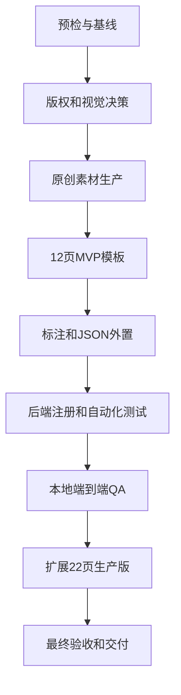

# 红金年会颁奖 PPT 模板开发 Goal

## 1. Goal 信息

| 项目 | 内容 |
|---|---|
| Goal 名称 | 完成红金年会颁奖 PPT 模板开发 |
| 工作目录 | `D:\moling\TrainPPTAgent` |
| 模板 ID | `template_7` |
| 模板名称 | 红金年会颁奖 |
| 主开发文档 | [`红金年会颁奖PPT模板开发说明.md`](./红金年会颁奖PPT模板开发说明.md) |
| 参考 PPT | `C:\Users\sk20\Desktop\年会颁奖盛典晚会 (4).pptx` |
| 目标状态 | 本地开发完成并通过验收 |
| Git 策略 | 不主动提交、推送或部署，除非用户另行授权 |
| 当前执行状态 | `DONE`，用户已于 2026-08-21 人工确认闭合 |
| 验收记录 | [`红金年会颁奖PPT模板素材与QA记录.md`](./红金年会颁奖PPT模板素材与QA记录.md) |

## 2. Goal Objective

在 TrainPPTAgent 项目中完成 `template_7` 红金年会颁奖 PPT 模板的本地开发与验证。

最终模板必须使用原创或具有明确授权的素材，覆盖项目要求的五种页面类型，支持内容分页和图片替换，可以在前端完成选择、生成、编辑和 PPTX 导出，并通过功能、视觉、性能、设备适配和版权验收。

## 3. 用户可见结果

Goal 完成后，用户应获得以下能力：

1. 模板选择页显示“红金年会颁奖”。
2. 用户能够选择该模板并生成 PPT。
3. 生成结果包含封面、目录、章节、内容和结束页。
4. 目录能够适配 2、3、4、5、6、10 项。
5. 内容页能够适配 1～4 项，并支持超量内容分页。
6. AI 配图只替换内容图片，不替换奖杯、灯笼和背景。
7. 用户可以继续编辑生成结果。
8. 所有可见按钮具有操作反馈。
9. 用户可以导出并重新打开 PPTX。
10. 模板在桌面、平板和手机预览中不发生页面溢出。

## 4. 完成定义

执行者根据文件、测试、截图和导出物自动核对以下条件。证据齐全后进入 `READY_FOR_CONFIRMATION`（待人工确认）状态，并提交最终验收报告；只有用户明确确认后，才可以将 Goal 标记为完成：

- `template_7.json` 已生成并可被模板渲染器读取。
- `template_7.jpg` 已生成并可在模板列表正常显示。
- 必要的背景和装饰素材已生成、压缩、命名并外置。
- 模板已在后端模板列表注册。
- 五种页面类型均有可用版式。
- MVP 的 12 页最低版式覆盖已完成。
- 生产版已扩展到建议的 22 页，或有明确证据说明 22 页中某项不适用。
- 目录 2、3、4、5、6、10 项测试全部通过。
- 内容 1、2、3、4 项及 8 项分页测试通过。
- 0～3 张图片替换测试通过。
- 装饰图片保护测试通过。
- 长正文没有静默截断。
- 本地前端完成模板选择、生成、编辑和导出验证。
- 导出的 PPTX 已重新打开并逐页检查。
- 代表性桌面、平板、手机尺寸检查通过。
- 自动化测试通过。
- 文档、素材来源记录和 QA 证据完整。
- 未使用未授权素材，未保留第三方水印。

仅完成模板文件但未验证生成、编辑和导出流程，不算完成。自动验收通过也不等于 Goal 已闭合，最终闭合必须经过用户人工确认。

## 5. 执行边界

### 5.1 允许执行

- 阅读项目代码、测试和文档。
- 读取参考 PPT 的页面结构和视觉信息。
- 使用图像生成工具生产原创装饰素材，默认可使用 GPT Image 2（`gpt-image-2`）。
- 创建或修改 `template_7` 相关模板文件和图片资源。
- 修改模板列表注册代码。
- 增加或修改与 `template_7` 直接相关的测试。
- 在本地启动前端和后端进行验证。
- 在本地浏览器中测试模板选择、生成、编辑和导出流程。
- 创建测试数据、QA 截图和验证记录。
- 在必要时修复本任务直接暴露的模板渲染问题。

### 5.2 默认禁止

- 直接复制原 PPT 中版权不明确的装饰素材。
- 删除原始参考 PPT。
- 修改与模板任务无关的业务模块。
- 清理或覆盖用户已有的未提交更改。
- 使用虚假的公司 Logo、真实人物或获奖证书。
- 将标题、年份、公司名或人物姓名写进背景图片。
- 使用 Python 或程序化图形绘制装饰图片。
- 在未验证根因前大幅重写模板渲染器。
- 主动执行 Git 提交、推送、合并或生产部署。
- 声称某项验收通过但没有测试结果或可检查产物。

### 5.3 仍需用户授权的外部或不可逆操作

大部分本地设计、编码、测试和修复由执行者自动决定。只有以下外部或不可逆操作需要用户授权：

- 推送远程分支。
- 创建 Pull Request。
- 合并代码。
- 部署生产环境。
- 使用需要额外付费或授权的商业素材。
- 使用真实企业 Logo、员工照片或内部数据。

## 6. 必读资料

执行前必须阅读：

- [`红金年会颁奖PPT模板开发说明.md`](./红金年会颁奖PPT模板开发说明.md)
- [`Template.md`](./Template.md)
- [`PPT_Structure.md`](./PPT_Structure.md)
- [`API_TEMPLATE.md`](./API_TEMPLATE.md)
- [`backend/main_api/main.py`](../backend/main_api/main.py)
- [`backend/main_api/workers/template_renderer.py`](../backend/main_api/workers/template_renderer.py)
- [`backend/main_api/tests/test_template_renderer.py`](../backend/main_api/tests/test_template_renderer.py)
- [`frontend/src/hooks/useImport.ts`](../frontend/src/hooks/useImport.ts)
- [`frontend/src/hooks/useExport.ts`](../frontend/src/hooks/useExport.ts)

执行者需要先确认当前代码和文档是否已经变化。文档中的路径、接口或假设与代码冲突时，以当前代码为准，并在进度记录中说明差异。

## 7. 关键技术约束

### 7.1 模板页面类型

必须支持：

- `cover`
- `contents`
- `transition`
- `content`
- `end`

### 7.2 关键槽位

必须正确使用：

- `title`
- `content`
- `item`
- `itemTitle`
- `itemNumber`
- `partNumber`

### 7.3 图片替换约束

当前渲染器按页面图片元素的顺序填充 AI 配图。执行者必须确保普通图片节点只包含可替换的内容图片槽。

不可替换的灯笼、奖杯、帷幕、桂冠、粒子和相框装饰应优先合并进背景或转换为不会进入内容图片槽序列的结构。

如果现有模板结构仍无法保护装饰图片，必须先定位根因，再提出最小渲染器改动，并补充回归测试。不得通过覆盖或隐藏错误结果绕过问题。

### 7.4 资源约束

- 模板所需的背景图和透明装饰图可以使用 GPT Image 2（`gpt-image-2`）生成。
- 每张图片必须使用独立、明确的提示词生成，不能用一张包含多个素材的拼图代替独立资源。
- 提示词应说明素材用途、画面比例、构图、文字安全区、透明背景、红黑金配色和禁止项。
- 项目使用的最终图片必须复制到 `backend/main_api/template/`，不能只保留在图片生成工具的默认输出目录。
- 每张生成图片需要保存最终提示词、生成方式、文件路径和人工检查结果。
- 全屏不透明背景使用 JPG。
- 透明装饰使用带 Alpha 通道的 PNG。
- 模板 JSON 不重复嵌入大型 Base64 图片。
- 不保留 WAV、WDP 和未引用资源。
- 图片文件使用小写英文、数字和下划线命名。
- 每张素材保存来源、授权状态或生成提示词。

### 7.5 代码和界面约束

- 新增代码必须使用中文注解解释关键逻辑。
- 前端变化必须适配桌面、平板和手机。
- 可见按钮必须具有点击反馈，不能点击无反应。
- 修改文件时保留用户已有的无关更改。
- 优先复用项目现有模板处理能力，不创建平行实现。

## 8. Goal 任务图



各阶段使用自动检查点，不设置人工审批门。执行者根据当前文件、测试和视觉证据自行判断是否通过；发现问题时直接修复并重新检查。MVP 核心链路稳定后，自动进入 22 页生产版扩展。

## 9. 分阶段执行计划

### G0：预检与基线

任务：

- 检查 Git 状态并记录已有改动。
- 确认 `template_7` 尚未被占用。
- 阅读必读资料和现有测试。
- 检查本地前后端启动方式。
- 建立 Goal 进度记录、素材来源记录和 QA 目录。
- 记录现有模板列表、生成流程和导出流程基线。

自动检查点：

- 已列出允许修改的文件范围。
- 已记录工作区已有改动。
- 已确认模板 ID 和资源目录。
- 已确定可复用的现有测试及启动命令。

### G1：版权和视觉决策

任务：

- 将参考 PPT 只作为布局与配色参考。
- 确认不直接复用版权不明确的原始装饰。
- 冻结红、黑、金视觉体系。
- 确认 16:9、跨年份、无生肖依赖的设计方向。
- 确定 Logo 槽位是否保留为空白可配置区域。

默认决策：

- 没有授权证明时，全部装饰重新生成。
- 不使用真实公司 Logo 和真实人物。
- 去除固定年份和生肖元素。
- 使用 `template_7`。

自动检查点：

- 视觉方向和版权边界可以支持后续素材生产。
- 所有未确认项均已采用安全默认值或明确记录为阻断项。

### G2：原创素材生产

本阶段默认允许使用 GPT Image 2（`gpt-image-2`）生成模板背景和装饰位图。不同用途的素材必须分别生成，不能通过一次生成请求批量产出难以裁切和复用的素材拼图。

先生产 MVP 所需核心素材：

1. 主舞台背景。
2. 深色内容背景。
3. 章节背景。
4. 落幕背景。
5. 红色帷幕。
6. 舞台底部。
7. 红金灯笼。
8. 金色奖杯。
9. 金色桂冠。
10. 空白标题框。
11. 聚光灯。
12. 单人相框。

要求：

- 默认使用 GPT Image 2（`gpt-image-2`）生成原创位图素材；如果使用其他工具，必须记录工具名称和授权情况。
- 每个背景、帷幕、灯笼、奖杯、桂冠、标题框、聚光灯和相框使用独立提示词生成。
- 背景提示词应明确 16:9 构图和文字安全区；透明装饰提示词应明确要求真实透明背景和完整物体边缘。
- 生成时明确画面比例、文字安全区和透明背景要求。
- 不在图片中生成文字、Logo、人物姓名或年份。
- 逐张检查边缘、透明通道、光源方向和风格一致性。
- 压缩发布版本，同时保留原始版本和提示词。

自动检查点：

- 4 张背景和 8 张核心装饰通过视觉检查。
- 素材命名、格式、尺寸和来源记录完整。
- 所有素材都能安全用于模板，不含水印和伪造标识。

### G3：12 页 MVP 模板

制作：

- 1 页封面。
- 6 页目录，分别支持 2、3、4、5、6、10 项。
- 1 页章节过渡。
- 3 页内容，分别支持 2、3、4 项。
- 1 页结束。

要求：

- 标题、正文、编号和图片均保持可编辑。
- 同一内容项的标题、正文、编号和装饰保持同组关系。
- 目录和内容槽位数量必须与版式容量一致。
- 标题和正文不能写入背景图。
- 装饰不能进入内容图片槽序列。
- 页面保持 16:9，并使用统一边距和字体。

自动检查点：

- 12 页 MVP 均可在项目编辑器中打开。
- 页面类型和内容槽位可以被正确标注。
- 没有明显溢出、遮挡、破图或字体异常。

### G4：标注、JSON 和资源外置

任务：

- 标注五种页面类型。
- 标注文字、编号和内容图片槽位。
- 导出 `template_7.json`。
- 将大型图片从 JSON 外置到模板资源目录。
- 更新 JSON 中的图片地址。
- 生成 `template_7.jpg` 模板封面。
- 检查无用元素、空槽和重复资源。

自动检查点：

- JSON 可以被 `PresentationTemplateRenderer` 读取。
- 模板画布比例正确。
- 图片资源地址全部有效。
- JSON 不含重复 Base64 大图。
- 模板列表封面清晰且体积合理。

### G5：后端注册和自动化测试

任务：

- 在模板列表中注册 `template_7`。
- 增加模板文件存在、格式和 ID 测试。
- 测试目录 2、3、4、5、6、10 项版式选择。
- 测试内容 1、2、3、4 项选择。
- 测试 8 项内容分页。
- 测试长正文拆分及字符顺序。
- 测试 0～3 张图片填充。
- 测试装饰图片不被替换。
- 测试资源缺失和模板损坏错误。

自动检查点：

- 目标测试全部通过。
- 新测试能够在模板被破坏时失败。
- 没有通过降低断言或跳过错误获得假成功。

### G6：本地端到端 QA

任务：

- 启动本地前后端。
- 在模板选择页确认模板封面、名称和选中反馈。
- 使用覆盖五种页面的测试数据生成一套作品。
- 逐页检查渲染结果。
- 验证编辑文字和替换图片。
- 验证所有相关按钮都有反馈。
- 导出 PPTX 并重新打开检查。
- 检查桌面、平板和手机代表尺寸。
- 保存截图、控制台错误和测试结果。

代表尺寸：

- 1366×768。
- 1920×1080。
- 768×1024。
- 390×844。

自动检查点：

- 生成、编辑和导出主流程通过。
- 页面无明显溢出、遮挡和图片变形。
- 浏览器控制台没有与模板相关的未处理错误。
- 所有可见操作均有反馈。

### G7：22 页生产版扩展

仅在 G6 通过后执行。

扩展目标：

- 2 个封面。
- 6 个目录。
- 4 个章节过渡。
- 8 个内容版式。
- 2 个结束页。

新增内容版式应覆盖：

- 单项结论。
- 单项图文。
- 双图文。
- 三人物。
- 年度数字。
- 其他经过实际内容需求验证的版式。

自动检查点：

- 22 页页面风格一致但构图不过度重复。
- 新版式不破坏 MVP 的选择和分页规则。
- 新版式均有测试或端到端验证证据。

### G8：最终验收和交付

任务：

- 运行所有受影响测试。
- 重新执行模板端到端流程。
- 检查所有模板页面和导出页面。
- 检查资源体积和未引用文件。
- 检查版权记录和生成提示词。
- 更新开发文档中的实际结果和偏差。
- 输出文件清单、测试结果、截图和已知限制。
- 生成最终验收报告，并将状态设置为 `READY_FOR_CONFIRMATION`。
- 请求用户检查验收报告并明确确认是否闭合 Goal。

自动检查点：

- 第 4 章完成定义全部满足。
- 没有未说明的测试失败或版权风险。
- 用户可以从交付说明中复现验证结果。
- 自动检查通过后只允许进入 `READY_FOR_CONFIRMATION`，不得自动标记 Goal 完成。
- 收到用户明确的“确认完成”或等价指令后，才执行最终闭合操作。

## 10. 自动验收检查

### 10.1 功能检查

- 五种页面类型必须全部工作。
- 目录容量选择必须准确。
- 内容分页必须保留顺序和全部字符。
- 图片必须进入正确槽位。
- 模板必须可选择、生成、编辑和导出。

### 10.2 视觉检查

- 标题不意外换行，正文不溢出。
- 图片不拉伸，不出现错误裁剪。
- 红、黑、金的色彩和光源保持一致。
- 不出现水印、示例公司、固定年份和操作说明。
- 不存在不可用字体。

### 10.3 性能检查

建议目标：

| 指标 | 目标 |
|---|---:|
| `template_7.json` | 小于 1 MB |
| 全部外置素材 | 小于 10～15 MB |
| 单张背景 | 小于 800 KB |
| 单张透明装饰 | 小于 1 MB |
| 模板封面 | 小于 150 KB |

如果实际结果无法达到建议目标，应提供测量结果、原因和对用户体验的影响，不能直接忽略。

### 10.4 证据检查

每个阶段至少保留：

- 产出文件路径。
- 执行的验证命令或操作。
- 测试结果。
- 代表性截图或渲染图。
- 失败与修复记录。
- 未完成项及原因。

## 11. 自动决策与少数人工边界

### 11.1 自动决策规则

遇到以下情况可以采用安全默认值继续：

- 未指定公司 Logo：使用空白可配置区域，不生成假 Logo。
- 未提供真实人物：使用中性占位图或无人物版式。
- 未确认原素材授权：重新生成原创素材。
- 未指定年份：模板不写死年份。
- 未指定生肖：不加入生肖元素。
- `template_7` 未被占用：直接使用 `template_7`，不再请求确认。
- 需要背景和装饰图：默认使用 GPT Image 2 生成原创素材。
- 模板结构出现局部问题：允许执行者进行与 `template_7` 直接相关的最小代码修复，并补充测试。
- 某项建议性能指标未达到：记录实际数据和影响，继续完成其他工作，不等待人工批准。
- 阶段自动检查未通过：修复后重新检查，不把普通失败升级为人工门禁。

除第 11.2 节列出的情况外，执行者应自主选择安全、可逆、范围内的方案继续推进。

### 11.2 仍需用户确认的操作

- 需要使用真实公司 Logo、员工照片或内部数据。
- 需要购买或使用授权范围不明确的商业素材。
- 需要提交、推送、合并或部署。
- 需要删除或覆盖与本 Goal 无关的用户文件。
- G8 自动验收全部通过后的 Goal 最终闭合操作。

如果 `template_7` 意外已被占用，执行者不得覆盖现有模板。应先检查占用内容；若属于本 Goal 的中间成果则继续使用，否则记录冲突并请求用户选择新 ID。

### 11.3 自动重试与 Goal 阻断

普通测试失败、图片效果不佳、版式溢出和局部代码问题由执行者自动修复并重试。只有同一外部阻断重复出现、已尝试安全替代方案且无法继续时，才将 Goal 标记为阻断。

难度高、工作量大、测试耗时或尚未完成，不构成阻断。仍有安全的本地工作可以继续时，应继续推进。

## 12. 进度更新格式

执行过程中每完成一个阶段，使用以下格式更新：

```text
[阶段] G3：12 页 MVP 模板
[状态] 完成 / 进行中 / 阻断
[已完成] 本轮完成的文件和功能
[验证] 已运行的测试、截图或检查结果
[发现] 风险、差异或失败尝试
[下一步] 下一个具体任务
```

不要只报告“正在处理”。更新必须包含可检查的文件、测试或页面结果。

## 13. 最终交付报告格式

```text
STATUS: READY_FOR_CONFIRMATION / DONE / DONE_WITH_CONCERNS / BLOCKED

完成内容：
- 模板页面数量和类型
- 生成的素材
- 修改的代码和配置
- 新增的测试

验证结果：
- 单元测试
- 前端生成流程
- 编辑和图片替换
- PPTX 导出
- 多设备检查

产物：
- 模板 JSON
- 模板封面
- 图片资源
- QA 截图和记录

剩余问题：
- 已知限制
- 未决授权或真实数据需求
- 后续可选优化

人工确认：
- 自动验收通过后填写“等待用户确认”
- 用户明确确认后才改为“已确认闭合”
```

## 14. Goal 执行提示词

以下提示词可以直接用于启动本 Goal：

```text
你正在 D:\moling\TrainPPTAgent 工作。请持续执行“红金年会颁奖 PPT 模板开发”Goal，直到本地开发和验证真正完成。

主要目标：
基于 doc\红金年会颁奖PPT模板开发说明.md 和 doc\红金年会颁奖PPT模板开发Goal.md，完成 template_7 红金年会颁奖模板的素材生产、页面制作、PPTist 标注、JSON 资源外置、后端注册、自动化测试、端到端 QA 和 PPTX 导出验证。

开始前：
1. 阅读两份文档及其中列出的代码、测试和模板规范。
2. 检查 Git 状态，保护用户已有改动，不清理 .codex-tmp 或其他无关文件。
3. 检查 template_7 是否已被占用，并核对当前代码是否与文档一致。
4. 建立阶段进度、素材来源和 QA 证据记录。

执行顺序：
G0 预检与基线 → G1 版权和视觉决策 → G2 原创素材生产 → G3 12 页 MVP → G4 标注和 JSON 外置 → G5 后端注册与测试 → G6 本地端到端 QA → G7 22 页生产版 → G8 最终验收。

硬性要求：
- 原参考 PPT 只作布局和风格参考，不能直接复用未授权素材。
- 模板所需背景和装饰位图默认可使用 GPT Image 2（gpt-image-2）生成；每种素材使用独立提示词，并保存最终提示词和生成记录。
- 不使用 Python 或程序化矢量绘制装饰图片。
- GPT Image 2 生成的项目素材必须保存到 backend/main_api/template/，不能只保留在默认生成目录。
- 背景和装饰不能包含文字、Logo、年份、真实人物或水印。
- 只有内容图片可以被 AI 配图替换，灯笼、奖杯、帷幕、桂冠、相框和背景必须保持不变。
- 支持 cover、contents、transition、content、end 五种页面。
- 目录必须覆盖 2、3、4、5、6、10 项，内容至少覆盖 2、3、4 项。
- 长正文和超量内容不得静默丢失。
- 新增代码使用中文注解。
- 前端变化兼顾桌面、平板、手机，所有可见按钮必须有反馈。
- 不主动提交、推送、合并或部署。
- 不覆盖用户无关改动，不使用破坏性 Git 命令。
- 不以未经验证的截图或主观判断代替测试。

工作方式：
- 每阶段先检查输入和依赖，再实施，再验证，再记录证据。
- G0～G7 由执行者根据证据自动确认，不等待用户逐项审批；MVP 核心链路稳定后自动扩展 22 页生产版。
- G8 自动验收通过后进入 READY_FOR_CONFIRMATION，提交最终报告并等待用户确认，不得自动闭合 Goal。
- 遇到失败先定位根因，不用覆盖、隐藏或降低断言绕过问题。
- 可以安全假设时继续推进；局部渲染器修改可在任务范围内自动完成并补充测试。
- 只有涉及真实数据、付费或授权不明素材、无关文件破坏、提交推送合并或部署时才请求用户决定。
- 每 60 秒内提供一次有内容的进度更新，说明完成项、验证结果、发现和下一步。

完成标准：
严格按照 Goal 文档第 4 章和第 10 章自动检查。模板文件、生成流程、编辑流程、图片替换、PPTX 导出、自动化测试、多设备检查和版权记录全部有证据后，只能报告 READY_FOR_CONFIRMATION。只有用户明确确认完成后，才能报告 DONE 并执行 Goal 闭合操作。

最终输出：
列出所有新增和修改文件、页面与素材数量、测试命令和结果、QA 截图、导出 PPTX、资源体积、已知限制和未决事项。自动验收完成后请求用户人工确认；未收到明确确认前，不得声称 Goal 已完成或执行闭合操作。
```

## 15. 相关文档

- [`红金年会颁奖PPT模板开发说明.md`](./红金年会颁奖PPT模板开发说明.md)
- [`Template.md`](./Template.md)
- [`PPT_Structure.md`](./PPT_Structure.md)
- [`API_TEMPLATE.md`](./API_TEMPLATE.md)
