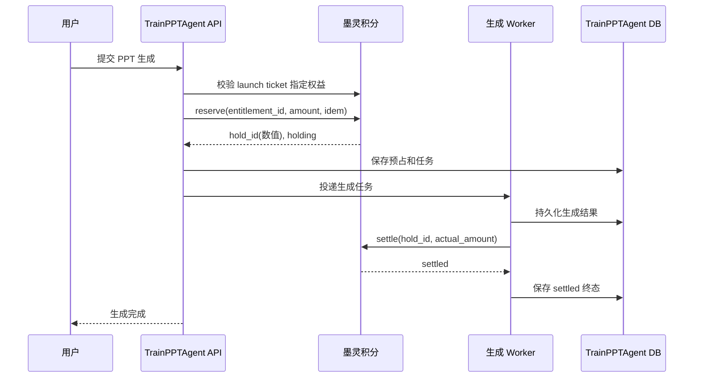

# TrainPPTAgent 对接墨灵积分技术需求与阶段规划

> 文档状态：实施基线草案
> 版本：v1.0
> 更新日期：2026-07-30
> 适用项目：TrainPPTAgent
> 对接系统：墨灵积分（预付权益）
> 核心边界：墨灵接口已具备能力，本期只修改 TrainPPTAgent

## 1. 文档目的

本文档用于指导 TrainPPTAgent 完成墨灵积分真实扣除闭环，统一产品、后端、测试、运维和验收口径。它同时包含：

1. 应用侧积分技术需求；
2. 墨灵接口调用契约；
3. 预占、结算、释放和对账流程；
4. 分阶段实施计划与交付门禁；
5. 测试、灰度、回滚和完成定义。

本文档不要求修改墨灵平台代码。若联调中发现平台返回与已确认契约不一致，应先保存脱敏证据并完成双方确认，不能在 TrainPPTAgent 中用临时兼容逻辑掩盖契约问题。

## 2. 结论与当前状态

### 2.1 核心结论

TrainPPTAgent 不应新增一个孤立的“扣 1 分接口”，而应在现有 PPT 生成任务中接入墨灵预付权益闭环：

```text
校验用户与配置
  -> 校验启动票据指定的权益
  -> 预占积分
  -> 执行 PPT 生成
  -> 先持久化生成结果
  -> 成功结算 / 明确失败释放 / 结果不确定进入对账
```

应用必须保证：没有成功预占就不启动收费任务；不能确认生成成功时不直接结算；不能确认生成失败时不盲目释放；每个任务最终只能进入一个终态。

### 2.2 已具备能力

| 能力 | 当前实现位置 | 状态 |
|---|---|---|
| 墨灵内部接口客户端 | `backend/main_api/integrations/moling.py` | 已改为数值 `hold_id` 契约 |
| 资产入口权益固化 | `backend/main_api/services/auth.py`、`backend/main_api/services/presentations.py` | 已实现，待阶段提交 |
| 指定权益校验策略 | `backend/main_api/services/billing.py` | 已实现，不回退其他资产 |
| 生成任务计费编排 | `backend/main_api/services/generation_orchestrator.py` | 已实现，待应用端闭环验收 |
| 计费状态持久化 | `backend/main_api/repositories/billing.py` | 已统一数值 ID，待生产迁移 |
| 失败重试与对账 | `backend/main_api/workers/reconciliation.py` | 已有自动化覆盖，待集成验收 |
| 计费开关与积分配置 | `backend/main_api/core/config.py` | 已有，默认关闭 |
| Fake/SQLite 自动化测试 | `backend/main_api/tests/` | 最近一次全量结果为 284 通过 |
| 墨灵直连最小真实扣分 | `backend/main_api/tools/real_billing_uat.py` | 目标权益已真实结算 1 积分 |
| 墨灵应用端完整验收 | 无 | 成功、失败释放和异常对账仍未完成 |

### 2.3 当前阻塞项

1. 资产级权益和数值 `hold_id` 改造仍在本地工作区，尚未形成可追溯的远程阶段提交。
2. 数据库迁移 `20260730_0008` 尚未在生产同类型隔离数据库完成升降级演练，也未应用到生产。
3. 当前 `BILLING_ENABLED=false`、`TASK_WORKER_ENABLED=false`，尚未形成应用端真实成功、真实失败释放和异常对账验收证据。
4. 目标权益已有 7 个更早的活动持有单，共 42 积分；早期受控测试另有 1 积分结算到非预期权益。两项历史事项都必须经授权审计处理，不能由应用自动补偿或直接改库。

## 3. 范围定义

### 3.1 本期范围

- 只修改 TrainPPTAgent 后端、配置、迁移、测试和运行文档；
- 使用墨灵现有内部预付权益接口；
- 接收墨灵从指定资产进入应用时绑定的权益，并只校验该权益；
- 在完整 PPT 生成任务中执行固定积分预占与结算；
- 明确失败时释放预占；
- 超时、网络中断或本地提交不确定时进入自动对账；
- 保存任务级计费操作、幂等键、重试次数和错误摘要；
- 提供计费总开关和紧急停止新预占能力；
- 完成自动化、集成、受控真实 UAT 和灰度验收。

### 3.2 非本期范围

- 不修改墨灵积分接口、数据库或管理后台；
- 不新建钱包余额扣减接口；
- 不同时扣“钱包积分”和“商品权益”；
- 不在 TrainPPTAgent 内部写死资产到权益映射，由墨灵 launch ticket 提供可信 `entitlement_id`；
- 不修改墨灵现有的用户、商品、权益归属模型；
- 不在第一阶段支持按页、按 Token 或动态成本计费；
- 不对保存、下载、导出、编辑等非生成动作收费；
- 不自动处理历史误扣，补偿操作必须经过业务授权并留下审计记录。

### 3.3 权益选择口径

当前范围采用“资产入口定向、权益全程固化”的口径：

1. 用户从墨灵目标资产的“进入应用”按钮启动 TrainPPTAgent；
2. 墨灵校验资产归属，并把对应 `entitlement_id` 写入一次性 launch ticket；
3. TrainPPTAgent 校验票据中的用户、应用和商品后，把权益 ID 保存到服务端 Session；
4. 创建收费任务时把该权益固化到计费操作，后续 Worker 不再重新选择；
5. 预占前只查询该权益余额，核对用户、状态、到期时间和可用额度；
6. 指定权益不足或不可用时拒绝生成，不切换同商品下其他资产；
7. 票据未指定权益时拒绝创建收费任务，提示用户从墨灵目标资产重新进入。

本轮受控 UAT 的业务目标为资产 `990206`，由墨灵可信入口映射到权益 `990306`。该映射只用于验收核对，不作为 TrainPPTAgent 代码中的静态配置。

## 4. 术语

| 术语 | 含义 |
|---|---|
| 商品 `product_id` | 墨灵中承载 TrainPPTAgent 服务权益的商品 |
| 权益 `entitlement_id` | 用户购买商品后获得的一份可消费预付权益 |
| 预占 `reserve` | 生成前冻结预计积分，防止并发超额消费 |
| 持有单 `hold_id` | 墨灵预占成功后返回的数值标识 |
| 结算 `settle` | 生成成功后把实际积分计入已使用额度 |
| 释放 `release` | 明确失败时归还预占额度，不增加已用额度 |
| 对账 `reconciliation` | 对结果不确定的操作查询本地证据并重试终态动作 |
| 计费终态 | `settled`、`released` 或经人工确认的终态 |
| 幂等键 | 同一业务动作重复请求时保持唯一结果的稳定标识 |

## 5. 墨灵接口契约

### 5.1 鉴权要求

TrainPPTAgent 仅通过服务端调用墨灵内部接口：

- 请求头：`X-Internal-Token: <由运行环境注入>`；
- 来源地址必须满足墨灵 IP 白名单；
- Token 不得传给浏览器、写入代码、测试快照或普通日志；
- 日志只能记录请求追踪号、接口名、HTTP 状态和脱敏错误摘要；
- 启动时缺少内部 Token，应直接判定计费配置无效。

### 5.2 查询票据指定权益

```http
GET /api/internal/entitlement-balance?entitlement_id={entitlement_id}&user_id={user_id}
```

用途：校验 launch ticket 指定权益的用户归属、状态、到期时间和可用额度。该查询不用于搜索或替换其他权益，是否可扣最终以预占接口原子判断为准。

### 5.3 预占积分

```http
POST /api/internal/entitlement-reserve
Content-Type: application/json

{
  "entitlement_id": 10001,
  "user_id": 20001,
  "amount": "1",
  "idempotency_key": "ppt:<task_id>:reserve"
}
```

关键要求：

- `amount` 使用十进制定点字符串，禁止浮点数；
- `idempotency_key` 对同一任务稳定且唯一；
- 成功响应中的 `hold_id` 必须按整数解析和保存；
- 预占失败时不得调用模型或生成 PPT；
- HTTP 超时不等于预占失败，必须进入结果不确定状态，禁止直接再换权益预占。

### 5.4 结算积分

```http
POST /api/internal/entitlement-settle
Content-Type: application/json

{
  "hold_id": 30001,
  "actual_amount": "1"
}
```

关键要求：

- `hold_id` 必须发送 JSON 数值，不得发送字符串；
- `actual_amount >= 0` 且不得大于预占金额；
- 只有生成结果已可靠持久化后才能结算；
- 超时或连接中断进入 `billing_pending`，由对账任务重试；
- 不因前端重复轮询或重复提交而产生第二次结算。

### 5.5 释放积分

```http
POST /api/internal/entitlement-release
Content-Type: application/json

{
  "hold_id": 30001
}
```

关键要求：

- 仅在任务明确失败且不存在可交付结果时释放；
- `hold_id` 必须发送 JSON 数值；
- 释放只归还预占，不增加已使用额度；
- 调用结果不确定时进入对账，不能同时尝试结算和释放。

### 5.6 可选接口

- `GET /api/internal/entitlement-balance`：可用于诊断或展示，不得代替预占的原子余额判断；
- `POST /api/internal/entitlement-consume`：适合简单即时扣减，本期生成任务不使用，避免绕过预占闭环。

### 5.7 主要错误处理

| 场景 | 平台错误/状态 | TrainPPTAgent 行为 |
|---|---|---|
| 权益不存在或已失效 | `40400` 或业务无可用项 | 返回“当前商品无可用权益”，不启动生成 |
| 归属或内部鉴权失败 | `40003` | 拒绝任务，记录安全事件，不自动重试 |
| 参数或类型错误 | `40000` | 判定应用缺陷，报警，不盲目重试 |
| 余额不足 | `60005` | 返回积分不足，不调用生成服务 |
| 连接超时/连接重置 | 结果不确定 | 保存 `billing_pending`，交由对账 |
| 服务端 5xx | 结果不确定 | 有限退避重试；超过阈值转人工处理 |

## 6. 应用侧功能需求

### FR-001 用户和商品绑定

每个收费任务必须绑定已认证的墨灵 `user_id` 和服务端配置的 `product_id`。客户端不得自行传入或覆盖收费商品。

### FR-002 原子预占

调用生成模型前，系统必须对选定权益执行一次原子预占。只有状态确认成功后任务才能进入生成队列。

### FR-003 固定金额策略

第一阶段采用固定金额：

- `PPT_GENERATION_RESERVE_POINTS`：生成前预占积分；
- `PPT_GENERATION_SETTLE_POINTS`：成功后实际结算积分；
- 结算积分必须小于或等于预占积分；
- 两者必须为大于等于零的十进制定点值，当前实现按整数积分启用。

价格调整只通过受控配置发布，不由前端参数决定。

### FR-004 成功后结算

生成文件、结构化结果和任务状态先完成持久化，再调用结算。结算成功后任务计费状态更新为 `settled`。

### FR-005 明确失败后释放

生成明确失败且没有可交付结果时调用释放。释放成功后计费状态更新为 `released`，任务保留原始失败原因。

### FR-006 不确定结果对账

以下情况必须进入 `billing_pending`：

- 预占、结算或释放请求超时；
- 收到连接中断，无法确认平台是否处理；
- 墨灵调用成功但本地数据库提交失败；
- Worker 重启时存在未完成计费动作；
- 生成结果存在，但计费终态缺失。

### FR-007 单终态约束

同一预占只能结算或释放一次。应用不得并行发起结算和释放，也不得从 `settled` 转为 `released`，或从 `released` 转为 `settled`。

### FR-008 幂等与并发

- 预占键固定为 `ppt:<task_id>:reserve`；
- 本地审计动作键使用 `ppt:<task_id>:settle` 和 `ppt:<task_id>:release`；
- 同一 `task_id` 只能创建一条计费操作；
- Worker 抢占、重试和前端重复请求不得创建第二个预占；
- 平台终态调用以数值 `hold_id` 为权威标识；
- 数据库更新使用条件更新或锁，保证状态迁移原子性。

### FR-009 任务状态可见性

API 应区分：

- `insufficient_points`：余额不足，生成未启动；
- `generation_failed`：生成失败，预占已释放；
- `billing_pending`：生成或计费结果待对账；
- `completed`：生成完成且结算完成；
- `manual_required`：自动对账超过阈值，需要人工处理。

前端不得把 `billing_pending` 展示成“扣分成功”或“生成失败可立即重试”。

### FR-010 紧急开关

`BILLING_ENABLED=false` 时不得创建新的墨灵预占。关闭开关后，已有持有单仍必须由对账 Worker 完成结算或释放，避免长期冻结积分。

## 7. 数据与类型要求

### 7.1 `hold_id` 统一改造

墨灵 `hold_id` 为无符号整数语义。TrainPPTAgent 应进行以下改造：

| 层级 | 当前 | 目标 |
|---|---|---|
| Pydantic 响应模型 | `str` | 严格正整数 `int` |
| HTTP 结算/释放请求 | JSON 字符串 | JSON 数值 |
| 编排 Client Protocol | `str` | `int` |
| Repository DTO | `str` | `int` |
| 对账 Claim | `str` | `int` |
| SQLAlchemy 字段 | `String(128)` | `BigInteger` 或数据库等价整数类型 |
| Fake Client 与断言 | `"hold-1"` | 合法数值，例如 `51` |

迁移要求：

1. 新迁移只转换可解析为正整数的历史值；
2. 迁移前扫描非法字符串，并输出数量而非敏感业务明细；
3. 发现非法值时停止迁移，由人工确认，不能静默置空；
4. SQLite 测试库与生产数据库都要验证升级路径；
5. 如数据库类型不支持完整无符号范围，应用需校验平台实际 ID 上限并记录设计决定。

### 7.2 计费操作最小字段

每个任务至少保存：

- `task_id`；
- `user_id`；
- `product_id`；
- `entitlement_id`；
- `hold_id`；
- `reserved_amount`；
- `actual_amount`；
- 当前计费状态；
- reserve/settle/release 本地幂等键；
- 最近动作、重试次数和下次重试时间；
- 脱敏错误码和错误摘要；
- 创建、更新和终态时间。

金额字段必须使用 Decimal 或十进制定点字符串，不得经过二进制浮点运算。

## 8. 业务流程与状态机

### 8.1 正常成功流程



### 8.2 明确失败流程

```text
reserved -> generating -> generation_failed -> releasing -> released
```

只有“确定没有可交付结果”才能走释放。

### 8.3 结果不确定流程

```text
reserving / settling / releasing
  -> billing_pending
  -> 对账读取本地任务与结果证据
  -> 重试同一终态动作
  -> settled / released / manual_required
```

对账决策：

- 已有完整生成结果：只能尝试结算；
- 明确无结果且任务失败：只能尝试释放；
- 本地证据矛盾或缺失：转 `manual_required`，不得猜测终态。

## 9. 非功能要求

### 9.1 安全

- 内部 Token 只从密钥管理或环境变量读取；
- 不允许前端直接访问墨灵内部接口；
- 用户身份只来自服务端认证会话；
- 商品 ID 只来自服务端配置；
- 日志不得包含 Token、完整响应头或可复用鉴权信息；
- 人工补偿必须有授权人、原因、前后余额和操作结果审计。

### 9.2 可靠性

- 墨灵调用必须设置连接、读取和总超时；
- 只对结果不确定或可恢复错误有限重试；
- 业务错误和参数错误不重试；
- 对账采用指数退避并设置最大重试次数；
- Worker 重启后可恢复未完成计费操作；
- 禁止依赖内存状态决定是否扣分。

### 9.3 可观测性

至少提供以下指标：

- `billing_reserve_total{result}`；
- `billing_settle_total{result}`；
- `billing_release_total{result}`；
- `billing_pending_total`；
- `billing_manual_required_total`；
- `billing_operation_latency_seconds{action}`；
- `billing_hold_age_seconds`；
- 余额不足、鉴权失败、参数错误和平台 5xx 计数。

日志关联字段至少包含 `request_id`、`task_id`、`billing_action`、`billing_status` 和脱敏后的平台错误码。禁止在普通日志中打印完整内部 Token。

## 10. 配置基线

以下仅为字段示例，实际值由测试或生产环境安全注入：

```dotenv
BILLING_ENABLED=false
TASK_WORKER_ENABLED=true
PERSISTENCE_ENABLED=true
MOLING_SSO_ENABLED=true
MOLING_BASE_URL=https://<moling-host>
MOLING_INTERNAL_TOKEN=<secret-manager-reference>
MOLING_PPT_PRODUCT_ID=<configured-product-id>
PPT_GENERATION_RESERVE_POINTS=1
PPT_GENERATION_SETTLE_POINTS=1
BILLING_RECONCILE_INTERVAL_SECONDS=30
BILLING_RECONCILE_MAX_RETRIES=8
```

配置校验必须保证：

- 开启计费时，SSO、持久化和任务 Worker 同时开启；
- 商品 ID、积分金额、内部 Token 和墨灵地址完整；
- 结算金额不大于预占金额；
- 生产环境不接受示例 Token、空 Token 或本地占位地址。

## 11. 分阶段实施计划

### 阶段 P0：冻结与审计准备

目标：在继续真实扣分前，消除历史不确定性并建立可回滚基线。

任务：

- 保持 `BILLING_ENABLED=false`；
- 导出当前未终态计费操作的脱敏清单；
- 审计早期受控测试中结算到非预期权益的 1 积分；
- 由业务负责人授权后执行补偿，并保留前后余额和平台流水证据；
- 确认测试商品、测试用户、单次金额和累计损失上限；
- 记录当前数据库版本和可用回滚备份。

交付物：审计记录、UAT 授权单、测试数据清单、回滚点。

通过门禁：历史误扣已明确为“已补偿”或“经负责人书面接受”，且数据库中无来源不明的活动持有单。

### 阶段 P1：修复接口类型契约

目标：让 TrainPPTAgent 严格按墨灵已确认契约发送数值 `hold_id`。

任务：

- 修改墨灵客户端响应模型和参数校验；
- 修改结算、释放 JSON 请求体；
- 统一编排、Repository、对账和 DTO 类型；
- 增加数据库迁移，将 `hold_id` 转为整数类型；
- 更新 Fake Client 和现有断言；
- 增加“请求体中 `hold_id` 确实为 JSON number”的契约测试；
- 增加非法、零、负数、超范围 `hold_id` 测试。

交付物：代码、迁移、单元测试、迁移验证记录。

通过门禁：相关自动化测试全绿；抓包或 MockTransport 断言结算、释放均发送数值；旧字符串测试数据可受控迁移。

回滚：回退应用版本和对应迁移；计费开关保持关闭。

### 阶段 P2：闭环编排加固

目标：保证每个任务遵守“先预占、后生成、再单终态”的业务规则。

任务：

- 校验用户身份和服务端商品配置；
- 固化票据权益并完成余额、归属和状态判断；
- 确保预占成功后才投递生成；
- 确保生成结果先持久化后结算；
- 明确失败执行释放；
- 将所有不确定结果写入 `billing_pending`；
- 增加并发 Worker、重复提交和数据库提交失败测试；
- 校验同一任务只能创建一个 reserve 操作。

交付物：闭环编排实现、状态迁移测试、错误映射说明。

通过门禁：成功、失败、超时、重启、重复请求和并发场景全部有自动化测试，且不存在双预占、双结算或结算与释放并存。

### 阶段 P3：对账与运维能力

目标：让线上不确定操作能够自动收敛或明确转人工。

任务：

- 对账 Worker 按本地结果证据选择唯一终态动作；
- 使用同一 `hold_id` 重试，不创建新预占；
- 实施指数退避、最大重试和 `manual_required`；
- 增加陈旧持有单、待处理数量和失败率指标；
- 增加结构化日志和告警；
- 编写人工处理 Runbook，禁止直接改库跳状态。

交付物：对账测试、指标面板、告警规则、人工处理 Runbook。

通过门禁：模拟墨灵超时、TrainPPTAgent 重启和数据库提交失败后，任务能自动收敛到正确终态；无法判断的任务能在阈值后报警并转人工。

### 阶段 P4：非生产集成验收

目标：在不产生真实生产积分损失的环境验证完整协议。

任务：

- 连接墨灵测试环境或双方认可的集成环境；
- 验证内部 Token、IP 白名单和商品配置；
- 验证权益查询、预占、结算、释放；
- 验证余额不足、无权益、归属错误和参数错误；
- 注入结算超时、释放超时和 Worker 重启；
- 核对 TrainPPTAgent 记录与墨灵流水一一对应。

交付物：接口证据、任务流水、前后余额、异常注入结果。

通过门禁：测试矩阵全部通过，无未释放持有单，无重复扣分，双方记录可按任务追溯。

### 阶段 P5：受控真实 UAT

目标：用最小真实积分验证生产网络、认证、数据和最终流水。

前置条件：P0-P4 全部通过，并取得明确的真实扣分授权。

执行顺序：

1. 保持全局计费关闭，仅对白名单测试用户启用；
2. 记录测试前商品权益、已用、预占和可用额度；
3. 执行一次最小金额成功生成，核对只增加一次已用额度；
4. 执行一次可控失败，核对预占归零且已用额度不增加；
5. 执行一次结算响应超时演练，核对对账最终收敛；
6. 核对应用计费操作、墨灵持有单和权益流水；
7. 记录测试后余额和每一步证据。

停止条件：

- 出现非预期权益被扣；
- 单任务扣分超过配置值；
- 同一任务出现多个持有单；
- 预占超过约定时间仍未终态；
- 应用记录与墨灵流水无法对应。

通过门禁：三个场景均有完整证据，累计扣分未超过授权上限，所有持有单均进入终态。

### 阶段 P6：灰度与正式启用

目标：在可观测、可停止、可恢复的条件下逐步启用积分计费。

任务：

- 先部署代码和迁移，但保持计费关闭；
- 验证 API、Worker、对账任务和监控身份；
- 按白名单或小比例用户灰度；
- 每个灰度阶段观察成功率、待对账量、陈旧持有单和客诉；
- 达标后逐步扩大范围；
- 发布用户可理解的积分不足和计费待确认提示。

通过门禁：连续观察窗口内无重复扣分、无超时持有单、无错误权益选择，错误率和对账积压低于发布阈值。

回滚策略：立即关闭新预占，保留 Worker 和对账处理已有持有单；必要时回退应用流量，但不得直接停止所有终态处理。

## 12. 测试矩阵

| 类别 | 场景 | 关键断言 |
|---|---|---|
| 单元 | 票据指定权益 | 只校验并使用该权益，不回退其他资产 |
| 单元 | 缺少或无可用指定权益 | 不调用 reserve，不启动生成 |
| 契约 | reserve 响应含数值 `hold_id` | 解析为整数并保存 |
| 契约 | settle/release 请求 | `hold_id` 是 JSON number |
| 契约 | 40000/40003/60005/40400 | 映射为正确应用错误且不盲目重试 |
| 编排 | 正常生成 | 先保存结果，再 settle，一次扣分 |
| 编排 | 明确生成失败 | release，已用额度不增加 |
| 编排 | reserve 超时 | 不启动生成，进入待对账 |
| 编排 | settle 超时 | 保留结果，进入待对账，不 release |
| 编排 | release 超时 | 保持释放方向，进入待对账，不 settle |
| 并发 | 两个 Worker 处理同一任务 | 只有一个预占和一个终态 |
| 恢复 | 墨灵成功、本地提交失败 | 对账使用原动作收敛 |
| 恢复 | Worker 在生成后退出 | 重启后根据持久化结果 settle |
| 迁移 | 历史数字字符串 | 无损转换为整数 |
| 迁移 | 历史非法字符串 | 迁移停止并报告，不静默丢失 |
| UAT | 最小真实成功 | 墨灵已用额度只增加配置金额 |
| UAT | 可控真实失败 | 预占归零、已用额度不增加 |
| UAT | 真实超时对账 | 最终单终态，无重复扣分 |

测试证据必须区分：Mock 通过、集成环境接受、真实平台受理、真实余额变化和最终人工验收。任何一个前置层级通过都不能代替后续层级。

## 13. 验证命令

以下命令在 TrainPPTAgent 仓库根目录执行，不包含生产写操作：

```powershell
python -m pytest backend/main_api/tests/test_moling_client.py -q
python -m pytest backend/main_api/tests/test_billing_orchestrator.py -q
python -m pytest backend/main_api/tests/test_billing_reconciliation.py -q
python -m pytest backend/main_api/tests/test_config.py -q
```

完成类型迁移后，还应执行项目全量后端测试和迁移升级/降级演练。真实 UAT 不应固化为可被普通 CI 自动执行的测试，必须由授权开关、白名单和消费上限保护。

## 14. 上线检查清单

- [ ] 墨灵平台代码未被本需求修改；
- [ ] `hold_id` 在所有应用层级统一为数值语义；
- [ ] settle/release 请求体发送 JSON number；
- [ ] 数据库迁移在生产同类型数据库演练通过；
- [ ] 固定预占与结算金额经产品确认；
- [ ] 计费开关默认关闭；
- [ ] 成功、失败、不确定三条路径自动化测试通过；
- [ ] 对账 Worker、重试上限和告警已启用；
- [ ] 内部 Token 和 IP 白名单验证通过；
- [ ] 历史误扣已完成授权处理；
- [ ] 真实 UAT 消费上限和停止条件已批准；
- [ ] UAT 后不存在非终态持有单；
- [ ] 灰度和回滚负责人已明确。

## 15. 完成定义（Definition of Done）

只有同时满足以下条件，才能宣布“TrainPPTAgent 已完成墨灵积分扣除闭环”：

1. 代码层面：预占、生成、结算、释放和对账均有实现；
2. 契约层面：所有 `hold_id` 均按墨灵要求以数值处理；
3. 数据层面：每个收费任务可追溯到唯一权益、持有单和终态；
4. 测试层面：自动化与非生产集成矩阵全部通过；
5. 真实层面：成功、失败释放和异常对账均完成受控真实 UAT；
6. 运维层面：监控、告警、紧急开关、Runbook 和回滚均可用；
7. 审计层面：历史误扣已闭环，真实测试前后余额与流水证据完整；
8. 产品层面：收费动作、积分金额和用户提示经过验收。

“接口返回 200”“预占成功”或“Mock 测试通过”都不等同于完整扣分闭环完成。

## 16. 待确认决策

| 决策项 | 建议默认值 | 确认角色 | 最晚确认阶段 |
|---|---|---|---|
| 单次 PPT 生成预占积分 | 1 | 产品/运营 | P1 前 |
| 单次 PPT 生成结算积分 | 1 | 产品/运营 | P1 前 |
| UAT 累计真实积分上限 | 最小可验证额度 | 业务负责人 | P5 前 |
| 对账最大重试次数 | 8 | 后端/运维 | P3 前 |
| 陈旧持有单告警阈值 | 结合平台超时确定 | 后端/运维 | P3 前 |
| 灰度范围与观察窗口 | 白名单起步 | 产品/运维 | P6 前 |
| 按页重生成是否收费 | 本期不收费 | 产品 | 后续版本 |

## 17. 参考资料

- [应用接入计费开发规范](./app/billing-integration-spec.md)
- [应用与财务商品计费集成设计](./app/billing-integration-design.md)
- [TrainPPTAgent 计费策略契约](./TrainPPTAgent计费策略契约.md)
- [业务与计费总览](./business-billing-overview.md)
